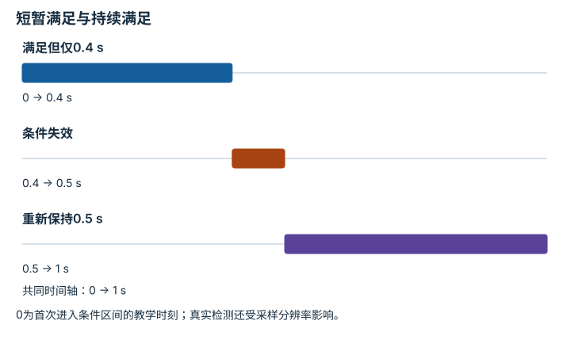

---
hide:
  - navigation
---

<!-- Generated by scripts/build_knowledge_atlas.py; edit knowledge/atlas/*.json. -->

<nav class="study-breadcrumb" aria-label="学习位置" markdown="1">
[知识目录](../../index.md) / [任务定义、复位、扰动与随机化](../index.md)
</nav>

L3 · 本章第 2 / 4 节

# 成功条件：把看起来完成变成可检查规则

**Success predicates**

物体短暂经过目标上方和稳定放入容器不同，视频印象不适合充当唯一成功标准。

先确认：这些前置知识我懂了吗？

布尔逻辑、单位与阈值

[场景动力学、接触与可观测性](../../sim-scene-dynamics/index.md) · [实验流程与溯源](../../computing-experiment-workflow/index.md)

<section class="study-section " markdown="1">

## 1 · 原理拆开看

1. 定义需要同时满足的几何、速度或保持时长条件，并明确边界是否包含等号。
2. 教学规则要求位置误差≤0.02 m且速度≤0.01 m/s，连续满足0.5 s。
3. 逐步更新保持计时，条件失效则按协议复位；奖励值与成功标签分别记录。

</section>

<section class="study-section " markdown="1">

## 2 · 跟着例子算一遍

1. 教学控制周期0.1 s，某回合连续4步满足条件，第5步速度超限。
2. 前4步累计0.4 s，尚未成功；第5步保持计时清零。
3. 之后连续5个完整采样间隔满足才达到0.5 s，需同时注明采样计时约定。

</section>

<section class="study-section " markdown="1">

## 3 · 对照图，解释变化

<figure class="atlas-visual" tabindex="0" aria-label="短暂满足与持续满足；窄屏可在图内横向滚动">
<picture>
<source media="(max-width: 600px)" srcset="../../../assets/knowledge-atlas/task-success-predicate-mobile.svg">

</picture>
<figcaption>教学成功判据，时间按完整采样区间累计。</figcaption>
</figure>

- 前一段累计不能跨过失败间隔直接拼接。
- 时间轴只解释规则，不构成某模型已经完成任务的证据。

查看作图数据，自己复算

图上数值可能为便于阅读而取近似值，以下保留作图输入。

| 事件 | 开始 (s) | 结束 (s) |
| --- | --- | --- |
| 满足但仅0.4 s | 0 | 0.4 |
| 条件失效 | 0.4 | 0.5 |
| 重新保持0.5 s | 0.5 | 1 |

</section>

<section class="study-section study-misconception" markdown="1">

## 4 · 避开一个误区

**容易误以为：**奖励高就等于任务成功。

**为什么不成立：**奖励可能鼓励接近目标或探索，而成功条件要求完成事件。

**正确理解：**单独定义并记录success predicate及验证样例。

</section>

<section class="study-section study-check" markdown="1">

## 5 · 先独立回答

位置误差0.01 m但速度0.05 m/s，本规则是否成功？

我已作答，查看推理

不满足速度条件；即使位置正确，也必须重新满足连续保持要求。

</section>

继续查阅原始资料

- [Gymnasium: Environment Step Contract](https://gymnasium.farama.org/api/env/#gymnasium.Env.step)

<nav class="study-pagination" aria-label="相邻小节" markdown="1">

[← 复位：每回合从哪个分布开始](../task-reset-distribution/index.md)

[域随机化：覆盖可能变化的因素 →](../task-domain-randomization/index.md)

</nav>

[返回本章目录](../index.md) · [整章连续阅读](../complete/index.md)

本章最后需要提交什么？

展示确定性回放与独立随机种子的鲁棒性扫描。

回到[原课程](../../../pipelines/01-simulation-data.md)完成实践。阅读位置或查看答案不计为通过验收。

