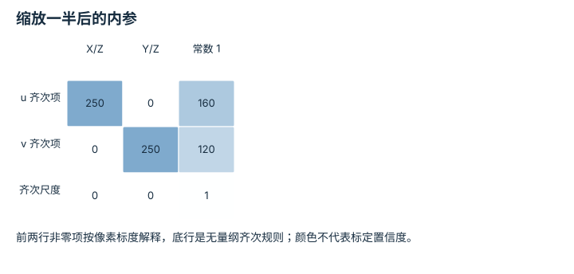
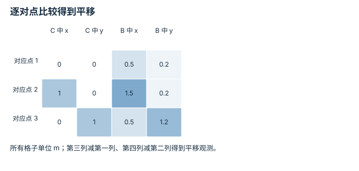
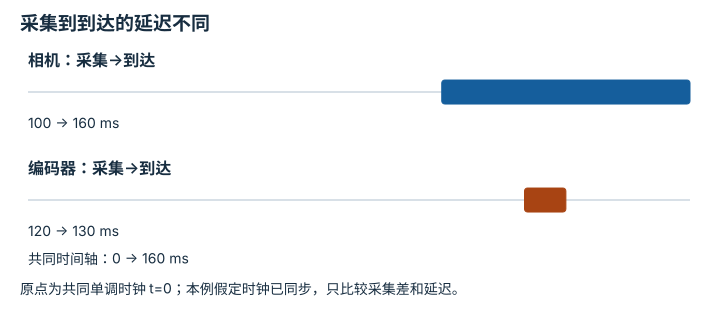
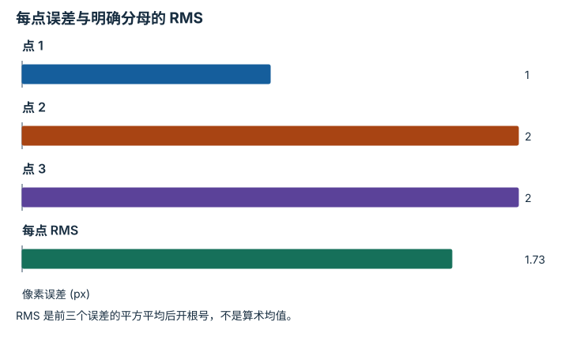

---
search:
  exclude: true
---

# 标定与时间同步：逐点细解

<!-- Generated by scripts/build_knowledge_atlas.py; edit knowledge/atlas/*.json. -->

[按小节学习](../index.md) · [全部知识点](../../index.md) · [返回原课程](../../../pipelines/09-perception-state-estimation.md)

Calibration and time synchronization · 本页拆成 **4 个小知识点**。

先阅读直觉和原理，再独立完成算例、自测；图是解释工具，不是已掌握或真机验证的证明。

## 前置知识

[传感器模型与观测语义](../../system-sensor-models/index.md)

## 改一个参数试试看

增大推理耗时，检查动作执行时所用观测有多旧。

[打开对应交互实验](../../../learning-lab-cn.md#timing)。滑块在文档站运行，GitHub 文件预览提供静态推导；不连接机器人。

## 本页知识点

1. [图像缩放后，像素内参也必须缩放](#calibration-intrinsics-resize)
2. [外参拟合先问数据能约束哪些自由度](#calibration-extrinsic-observability)
3. [消息同时到达，不代表同时采集](#calibration-timestamp-alignment)
4. [重投影误差低，也要验证尺度和未见姿态](#calibration-reprojection-validation)

## 1. 图像缩放后，像素内参也必须缩放

**Intrinsic calibration and image resizing**

**需要先懂：**针孔相机、矩阵

### 一句话直觉

把 640×480 图像缩成一半，却沿用原内参，投影点会落到错误像素。

### 原理拆开看

1. 焦距 fx、fy 与主点 cx、cy 在内参 K 中以像素单位记录，依赖图像坐标定义。
2. 按左上角原点将图像和坐标等比例缩放 s 时，这四项都乘 s；裁剪还需要主点平移。
3. 标定应保留原分辨率、裁剪和缩放约定，不能只保存九个矩阵数字。

### 手算或追踪一个例子

1. 教学 K 的 fx=fy=500 px、cx=320 px、cy=240 px，图像坐标缩放 s=0.5。
2. 新内参为 fx=fy=250 px、cx=160 px、cy=120 px。
3. 归一化横坐标 X/Z=0.1 的点，从 u=370 px 变成 185 px，与图像横坐标缩半一致。

### 用图理解

<figure class="atlas-visual" tabindex="0" aria-label="缩放一半后的内参；窄屏可在图内横向滚动">
<picture>
<source media="(max-width: 600px)" srcset="../../../assets/knowledge-atlas/calibration-intrinsics-resize-mobile.svg">

</picture>
<figcaption>教学示意，非实测；使用正文定义的理想坐标缩放规则。</figcaption>
</figure>

- 焦距项和主点项一起缩半，底部的 1 不缩放。
- 真实重采样库可能采用不同像素中心规则，应通过实际坐标映射验证而非机械套数值。

查看作图数据，自己复算

图上数值可能为便于阅读而取近似值，以下保留作图输入。

| 行 / 列 | X/Z | Y/Z | 常数 1 |
| --- | --- | --- | --- |
| u 齐次项 | 250 | 0 | 160 |
| v 齐次项 | 0 | 250 | 120 |
| 齐次尺度 | 0 | 0 | 1 |

### 容易混淆的地方

**常见误解：**相机没动，图像缩放也不需要改内参。

**为什么不成立：**物理镜头没动，但每米或每角度对应的像素数量改变了。

**正确理解：**让内参与最终图像预处理合同匹配，并核对具体像素中心约定。

### 自测

在本教学坐标规则下，再从左边裁掉 20 px，新主点 cx 是多少？

展开答案与推理

从 160 变成 140 px；裁剪平移原点，不应把 fx 再减 20。

**原始资料：**[OpenCV calibration and image-resolution scaling](https://docs.opencv.org/4.x/d9/d0c/group__calib3d.html)

## 2. 外参拟合先问数据能约束哪些自由度

**Extrinsic calibration and observability**

**需要先懂：**刚体变换、最小二乘

### 一句话直觉

只对齐一个点，很多旋转和平移组合都能让这个点重合；低残差不一定表示外参被唯一确定。

### 原理拆开看

1. 外参把传感器坐标映到机器人基座；若旋转未知，位置对必须提供足够几何约束。
2. 本例只估计二维平移，已知 R=I，因此每对点的差 p_B-p_C 都是一次平移观测。
3. 对这些差求均值可拟合平移；若要估计完整刚体变换，还需要合适分布的多个点或充分运动激励。

### 手算或追踪一个例子

1. 教学相机点为 (0,0)、(1,0)、(0,1) m；对应基座点为 (0.5,0.2)、(1.5,0.2)、(0.5,1.2) m。
2. 每对差都是 (0.5,0.2) m，均值也是该值。
3. 得到平移 t_BC=(0.5,0.2) m、残差为零；零残差只针对这个无噪声、已知旋转算例。

### 用图理解

<figure class="atlas-visual" tabindex="0" aria-label="逐对点比较得到平移；窄屏可在图内横向滚动">
<picture>
<source media="(max-width: 600px)" srcset="../../../assets/knowledge-atlas/calibration-extrinsic-observability-mobile.svg">

</picture>
<figcaption>教学示意，非实测；每行是一对已知对应点。</figcaption>
</figure>

- 每行两组坐标不同，却描述同一个标定点，而非两个不同目标。
- 图假定旋转已知为零，不能据此跳过真实手眼标定中的旋转估计。

查看作图数据，自己复算

图上数值可能为便于阅读而取近似值，以下保留作图输入。

| 行 / 列 | C 中 x | C 中 y | B 中 x | B 中 y |
| --- | --- | --- | --- | --- |
| 对应点 1 | 0 | 0 | 0.5 | 0.2 |
| 对应点 2 | 1 | 0 | 1.5 | 0.2 |
| 对应点 3 | 0 | 1 | 0.5 | 1.2 |

### 容易混淆的地方

**常见误解：**一个点拟合得完全一致，就证明六维外参准确。

**为什么不成立：**一个点无法独立约束完整三维旋转和平移，存在许多等价拟合。

**正确理解：**检查参数可辨识性、标定姿态覆盖和独立验证点。

### 自测

若第三个基座点误写为 (0.5,1.5) m，平均平移 y 会变成多少？

展开答案与推理

三次 y 差为 0.2、0.2、0.5 m，均值变成 0.3 m，其他点也会被系统性带偏；应先检查对应关系。

**原始资料：**[OpenCV camera and hand-eye calibration](https://docs.opencv.org/4.x/d9/d0c/group__calib3d.html)

## 3. 消息同时到达，不代表同时采集

**Acquisition time and synchronization**

**需要先懂：**时间戳、速度与位移

### 一句话直觉

相机传输慢、编码器传输快，把最新消息直接拼在一起，可能拼出从未存在过的机器人状态。

### 原理拆开看

1. 采集时间表示物理观测对应的时刻，到达时间还包含传输与调度延迟。
2. 先将时间戳映射到共同的时钟，再按采集时间匹配；时钟偏移和漂移本身也需要测量。
3. 残余时间差 Δt 在匀速近似下造成位置错配 vΔt；同步容差应由任务运动尺度决定。

### 手算或追踪一个例子

1. 教学相机在共同时间 100 ms 采集、160 ms 到达；编码器在 120 ms 采集、130 ms 到达。
2. 编码器虽然先到，实际采集却比图像晚 20 ms。
3. 若目标速度为 0.5 m/s，20 ms 对应 0.01 m 位移错配；不能把消息到达顺序当成场景顺序。

### 用图理解

<figure class="atlas-visual" tabindex="0" aria-label="采集到到达的延迟不同；窄屏可在图内横向滚动">
<picture>
<source media="(max-width: 600px)" srcset="../../../assets/knowledge-atlas/calibration-timestamp-alignment-mobile.svg">

</picture>
<figcaption>教学示意，非实测；区间表示传输与等待，不表示曝光持续时间。</figcaption>
</figure>

- 相机条带开始更早却结束更晚，说明到达次序可与采集次序相反。
- 条带不能证明真实时钟已校准；实际系统还要测时钟偏移与漂移。

查看作图数据，自己复算

图上数值可能为便于阅读而取近似值，以下保留作图输入。

| 事件 | 开始 (ms) | 结束 (ms) |
| --- | --- | --- |
| 相机：采集→到达 | 100 | 160 |
| 编码器：采集→到达 | 120 | 130 |

### 容易混淆的地方

**常见误解：**把时间容差设很大，消息都能配上就表示同步完成。

**为什么不成立：**配对成功率提高可能以更大的物理状态错配为代价。

**正确理解：**报告采集时钟、偏移估计、延迟和配对残差，必要时插值或拒绝过旧消息。

### 自测

若速度增至 2 m/s，仍有 20 ms 偏差，位置错配是多少？

展开答案与推理

为 2×0.02=0.04 m；同一时间容差在更快运动下产生更大空间误差。

**原始资料：**[ROS message_filters timestamp synchronization](https://docs.ros.org/en/ros2_packages/rolling/api/message_filters/message_filters.html)

## 4. 重投影误差低，也要验证尺度和未见姿态

**Reprojection error and held-out validation**

**需要先懂：**相机投影、均方根误差

### 一句话直觉

模型把标定角点投回图像很准，不代表机器人坐标里的毫米尺度也一定正确。

### 原理拆开看

1. 用估计内外参投影三维标定点，与检测到的像素点比较，误差单位为 px。
2. 本例 RMS 按每点二维欧氏残差的平方取平均再开根号，必须说明分母是点数还是坐标分量数。
3. 还需用未参与拟合的姿态、不同图像区域及已知物理尺度验证；训练重投影误差不能排除退化或尺度错误。

### 手算或追踪一个例子

1. 教学三个观测点为 (100,100)、(200,100)、(100,200) px；预测为 (101,100)、(200,102)、(98,200) px。
2. 每点欧氏残差分别为 1、2、2 px，平方和为 9 px²。
3. 以点数 3 为分母，RMS=√(9/3)=√3≈1.732 px；若改按 6 个坐标分量平均会得到约 1.225 px，定义不同。

### 用图理解

<figure class="atlas-visual" tabindex="0" aria-label="每点误差与明确分母的 RMS；窄屏可在图内横向滚动">
<picture>
<source media="(max-width: 600px)" srcset="../../../assets/knowledge-atlas/calibration-reprojection-validation-mobile.svg">

</picture>
<figcaption>教学示意，非实测；RMS 使用 3 个二维点作为分母。</figcaption>
</figure>

- RMS 约 1.732 px，介于最小和最大单点误差之间。
- 四根柱没有包含物理尺长或测试姿态覆盖，不能单独证明整体标定可信。

查看作图数据，自己复算

图上数值可能为便于阅读而取近似值，以下保留作图输入。

| 项目 | 像素误差 (px) |
| --- | --- |
| 点 1 | 1 |
| 点 2 | 2 |
| 点 3 | 2 |
| 每点 RMS | 1.732051 |

### 容易混淆的地方

**常见误解：**重投影误差足够小，就能保证物理尺度正确。

**为什么不成立：**三维点和相机平移同时按比例缩放，像素投影仍可保持相同。

**正确理解：**保存标定板物理尺寸、单位和独立验证集，同时检查空间和时间误差。

### 自测

真实棋盘格边长 40 mm，却按 20 mm 建模，为什么像素误差仍可能很小？

展开答案与推理

估计平移尺度也可能缩为一半，投影比值不变；低像素误差不能发现这类整体尺度混淆。

**原始资料：**[OpenCV calibration and reprojection error](https://docs.opencv.org/4.x/d9/d0c/group__calib3d.html)

## 从理解走向证据

本节点原有验收要求：报告重投影误差、时钟来源与同步偏差。

完成图解自测后，回到[原课程](../../../pipelines/09-perception-state-estimation.md)运行对应示例并保留证据；浏览页面和查看答案不会自动获得课程晋级。
