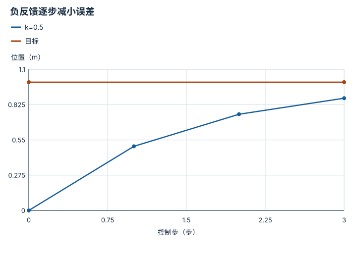
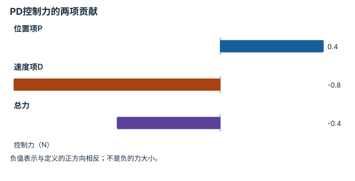
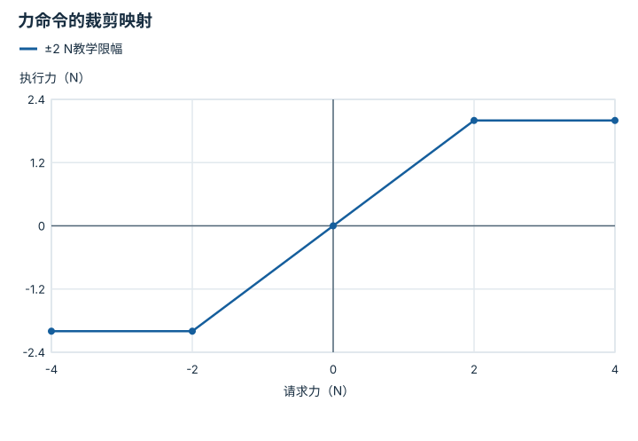
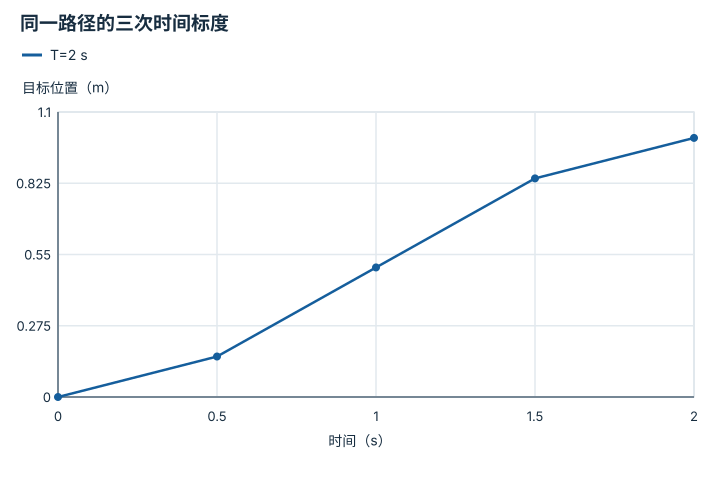

# 反馈、轨迹与饱和：逐点细解

<!-- Generated by scripts/build_knowledge_atlas.py; edit knowledge/atlas/*.json. -->

[全部知识点](../index.md) · [返回原课程](../../foundations/08-control-basics.md)

Feedback, trajectories, and saturation · 本页拆成 **4 个小知识点**。

先阅读直觉和原理，再独立完成算例、自测；图是解释工具，不是已掌握或真机验证的证明。

## 前置知识

[刚体动力学与积分](../robot-rigid-body-dynamics/index.md)

## 改一个参数试试看

分别改变增益、延迟、饱和上限；每次只改一项并解释轨迹变化。

[打开对应交互实验](../../learning-lab-cn.md#control)。滑块在文档站运行，GitHub 文件预览提供静态推导；不连接机器人。

## 本页知识点

1. [负反馈：为什么要减去实际状态](#control-negative-feedback)
2. [P与D：拉回目标和抑制运动](#control-pd-damping)
3. [饱和：请求的动作不是执行的动作](#control-actuator-saturation)
4. [轨迹不是终点：给路径加上时间](#control-trajectory-time-scaling)

## 1. 负反馈：为什么要减去实际状态

**Negative feedback**

**需要先懂：**误差、离散时间

### 一句话直觉

只发送目标不能知道是否到达；反馈用实际误差决定下一次修正方向。

### 原理拆开看

1. 一维纯教学模型x下一步=x+u，x与步进命令u均用m，目标r=1 m。
2. 定义误差e=r−x，取u=ke，k为每步无量纲增益。
3. 误差下一步=(1−k)e；本模型0<k<2时误差衰减，真机动力学、延迟与饱和会改变结论。

### 手算或追踪一个例子

1. 教学输入x0=0 m，k=0.5，r=1 m。
2. 第一步u=0.5 m，x1=0.5；第二步u=0.25 m，x2=0.75。
3. 第三步x3=0.875 m；误差逐步减半，不是一步瞬移到目标。

### 用图理解

<figure class="atlas-visual" tabindex="0" aria-label="负反馈逐步减小误差；窄屏可在图内横向滚动">
<picture>
<source media="(max-width: 600px)" srcset="../../assets/knowledge-atlas/control-negative-feedback-mobile.svg">

</picture>
<figcaption>离散教学样本；连线仅用于读数，不表示步间连续运动。</figcaption>
</figure>

- 每一步离目标更近，但修正步长逐渐减小。
- 没有真实执行器或延迟，图不能证明机器人闭环稳定。

查看作图数据，自己复算

图上数值可能为便于阅读而取近似值，以下保留作图输入。线段的含义以本图图注和读图说明为准，不应自行解释为实测连续轨迹。

| 曲线 | 控制步（步） | 位置（m） |
| --- | --- | --- |
| k=0.5 | 0 | 0 |
| k=0.5 | 1 | 0.5 |
| k=0.5 | 2 | 0.75 |
| k=0.5 | 3 | 0.875 |
| 目标 | 0 | 1 |
| 目标 | 3 | 1 |

### 容易混淆的地方

**常见误解：**把减号改成加号也只是调整增益。

**为什么不成立：**正反馈会把偏差继续放大，改变闭环性质。

**正确理解：**先定义误差符号与执行器正方向，再检查修正是否减小误差。

### 自测

本教学模型k=2.5时，初始误差1 m的下一步是多少？

展开答案与推理

变为−1.5 m，幅值反而增大；这只是离散积分器算例，不能拿增益区间直接调真机。

**原始资料：**[Modern Robotics: Second-Order Error Dynamics](https://modernrobotics.northwestern.edu/nu-gm-book-resource/11-2-2-2-second-order-error-dynamics/)

## 2. P与D：拉回目标和抑制运动

**Proportional derivative control**

**需要先懂：**负反馈、牛顿第二定律

### 一句话直觉

只往目标拉容易冲过头；速度反馈让接近目标时也能产生制动作用。

### 原理拆开看

1. 教学模型质量m=1 kg、无外部阻尼、恒定目标；控制力u=Kp(r−x)−Kd v。
2. Kp单位N/m，Kd单位N·s/m；P项来自位置偏差，D项反对当前速度。
3. 无延迟、无饱和的线性模型阻尼比ζ=Kd/(2√(mKp))；这个参数不包括接触和硬件限制。

### 手算或追踪一个例子

1. 教学输入误差0.1 m、速度0.2 m/s，Kp=4 N/m、Kd=4 N·s/m。
2. P项0.4 N，D项−0.8 N，合力−0.4 N。
3. 物体尚未到目标却已获得制动力；该理想模型ζ=1，不代表实际系统必无超调。

### 用图理解

<figure class="atlas-visual" tabindex="0" aria-label="PD控制力的两项贡献；窄屏可在图内横向滚动">
<picture>
<source media="(max-width: 600px)" srcset="../../assets/knowledge-atlas/control-pd-damping-mobile.svg">

</picture>
<figcaption>只展示一次教学计算，不是控制器调参曲线。</figcaption>
</figure>

- 两项可以方向相反，总力不一定指向目标。
- 单时刻的力分解无法判定整个闭环轨迹是否稳定。

查看作图数据，自己复算

图上数值可能为便于阅读而取近似值，以下保留作图输入。

| 项目 | 控制力（N） |
| --- | --- |
| 位置项P | 0.4 |
| 速度项D | -0.8 |
| 总力 | -0.4 |

### 容易混淆的地方

**常见误解：**D项越大越安全，任何噪声下都应增大它。

**为什么不成立：**速度估计、差分噪声和延迟会改变实际响应。

**正确理解：**分开检验模型、测量滤波、饱和与时序；教学增益不是硬件参数建议。

### 自测

本算例速度改为−0.2 m/s，控制力是多少？

展开答案与推理

D项变为+0.8 N，总力1.2 N；它反对离开目标的运动方向。

**原始资料：**[Modern Robotics: Second-Order Error Dynamics](https://modernrobotics.northwestern.edu/nu-gm-book-resource/11-2-2-2-second-order-error-dynamics/)

## 3. 饱和：请求的动作不是执行的动作

**Actuator saturation**

**需要先懂：**反馈控制、执行器限制

### 一句话直觉

控制器能算出任意大的力，电机和驱动器却有有限能力；忽略这一步会错误解释失败。

### 原理拆开看

1. 教学力命令u请求单位N，执行器只接受−2到2 N。
2. 裁剪映射u执行=min(2,max(−2,u请求))使执行量不再线性随请求增加。
3. 若积分器仍累计无法实现的误差，可能产生windup；需要与执行限制协调的抗饱和设计。

### 手算或追踪一个例子

1. 教学请求依次为−4、−1、0、1、4 N。
2. 逐项裁剪得到−2、−1、0、1、2 N。
3. 请求从2升到4 N并未增加实际力；仅记录请求日志会误判执行器输出。

### 用图理解

<figure class="atlas-visual" tabindex="0" aria-label="力命令的裁剪映射；窄屏可在图内横向滚动">
<picture>
<source media="(max-width: 600px)" srcset="../../assets/knowledge-atlas/control-actuator-saturation-mobile.svg">

</picture>
<figcaption>教学限幅函数，边界值不是任何硬件的允许值。</figcaption>
</figure>

- 两端平台说明请求继续增加而执行量不再增加。
- 这条静态曲线没有表达电机热限制或响应延迟。

查看作图数据，自己复算

图上数值可能为便于阅读而取近似值，以下保留作图输入。线段的含义以本图图注和读图说明为准，不应自行解释为实测连续轨迹。

| 曲线 | 请求力（N） | 执行力（N） |
| --- | --- | --- |
| ±2 N教学限幅 | -4 | -2 |
| ±2 N教学限幅 | -2 | -2 |
| ±2 N教学限幅 | 0 | 0 |
| ±2 N教学限幅 | 2 | 2 |
| ±2 N教学限幅 | 4 | 2 |

### 容易混淆的地方

**常见误解：**限幅后已经保证真机安全。

**为什么不成立：**速度、碰撞、通信故障和累计能量仍可能危险。

**正确理解：**把限幅作为一个明确约束，同时由独立硬件安全链和风险评估处理实际风险。

### 自测

请求力4 N持续1 s，能否用4 N计算这段动量变化？

展开答案与推理

不能；本例最多执行2 N。还需实际力与时间记录才能积分，不能用请求替代测量。

**原始资料：**[MuJoCo XML reference: actuator limits](https://mujoco.readthedocs.io/en/stable/XMLreference.html#actuator)

## 4. 轨迹不是终点：给路径加上时间

**Trajectory time scaling**

**需要先懂：**位置与速度、导数

### 一句话直觉

相同起终点可以慢慢经过，也可以突然跳转；控制器需要知道每一时刻应在哪里。

### 原理拆开看

1. 路径只给几何位置，轨迹还给时间；设教学一维位移0到1 m，总时长T。
2. 令s=t/T，采用x=3s²−2s³ m，在s从0到1时连续变化。
3. 速度为(6s−6s²)/T m/s，两端速度为零；端点加速度仍可与前后静止段不连续。

### 手算或追踪一个例子

1. 教学输入T=2 s，取t=0、0.5、1、1.5、2 s。
2. 对应s=0、0.25、0.5、0.75、1，位置为0、0.15625、0.5、0.84375、1 m。
3. 中点速度0.75 m/s；把T翻倍会把相同路径的各时刻速度减半。

### 用图理解

<figure class="atlas-visual" tabindex="0" aria-label="同一路径的三次时间标度；窄屏可在图内横向滚动">
<picture>
<source media="(max-width: 600px)" srcset="../../assets/knowledge-atlas/control-trajectory-time-scaling-mobile.svg">

</picture>
<figcaption>标注点来自教学三次函数；点间连线仅辅助读数。</figcaption>
</figure>

- 中段位置变化快于两端，对应不同目标速度。
- 稀疏位置点不能替代连续时间导数与限制检查。

查看作图数据，自己复算

图上数值可能为便于阅读而取近似值，以下保留作图输入。线段的含义以本图图注和读图说明为准，不应自行解释为实测连续轨迹。

| 曲线 | 时间（s） | 目标位置（m） |
| --- | --- | --- |
| T=2 s | 0 | 0 |
| T=2 s | 0.5 | 0.15625 |
| T=2 s | 1 | 0.5 |
| T=2 s | 1.5 | 0.84375 |
| T=2 s | 2 | 1 |

### 容易混淆的地方

**常见误解：**位置连续就说明速度和加速度也满足限制。

**为什么不成立：**不同阶导数有独立边界，连接处也可能产生突变。

**正确理解：**分别检查位置、速度、加速度和jerk，并检查执行器与碰撞约束。

### 自测

保持路径，T改为4 s，最大速度是多少？

展开答案与推理

0.375 m/s；时间放大两倍使速度缩小两倍，加速度缩小四倍。

**原始资料：**[Modern Robotics: Point-to-Point Trajectories](https://modernrobotics.northwestern.edu/nu-gm-book-resource/9-1-and-9-2-point-to-point-trajectories-part-1-of-2/)

## 从理解走向证据

本节点原有验收要求：整定控制器并报告跟踪、超调、饱和与失败。

完成图解自测后，回到[原课程](../../foundations/08-control-basics.md)运行对应示例并保留证据；浏览页面和查看答案不会自动获得课程晋级。
