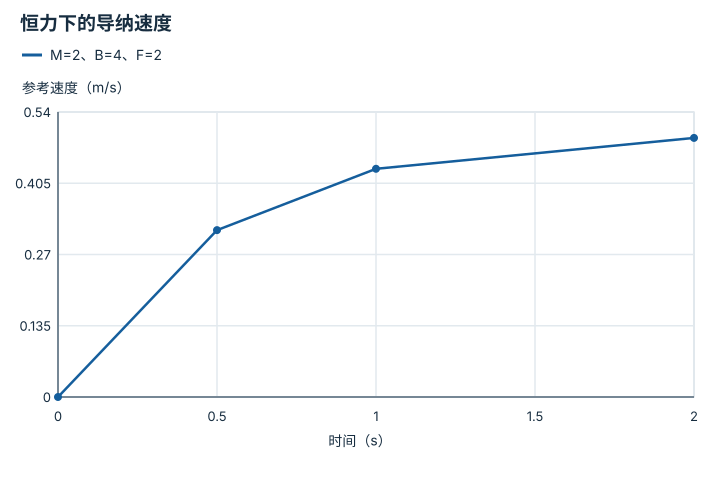

---
hide:
  - navigation
---

<!-- Generated by scripts/build_knowledge_atlas.py; edit knowledge/atlas/*.json. -->

<nav class="study-breadcrumb" aria-label="学习位置" markdown="1">
[知识目录](../../index.md) / [力、阻抗与柔顺交互](../index.md)
</nav>

L2 · 本章第 2 / 4 节

# 导纳：把外力变成运动参考

**Admittance control**

一些系统只能接收位置或速度命令；导纳先根据测得的外力生成应该让开的运动。

先确认：这些前置知识我懂了吗？

速度积分、力测量

[反馈、轨迹与饱和](../../system-feedback-control/index.md) · [接触、摩擦与抓取稳定性](../../robot-contact-friction/index.md)

<section class="study-section " markdown="1">

## 1 · 原理拆开看

1. 教学一维虚拟质量M用kg、阻尼B用N·s/m，外力F用N。
2. 导纳模型M·dv/dt+Bv=F把力输入转为速度；这与位置误差到力的阻抗方向不同。
3. 再将速度积分成位置参考，交给已有运动控制器；测量偏置和内环延迟会影响整体行为。

</section>

<section class="study-section " markdown="1">

## 2 · 跟着例子算一遍

1. 教学输入M=2 kg、B=4 N·s/m、v=0，恒力F=2 N。
2. 初始加速度=(2−4×0)/2=1 m/s²；若持续恒力，稳态速度F/B=0.5 m/s。
3. 解析速度v(t)=0.5(1−exp(−2t))；t=0.5 s约0.316 m/s，t=1 s约0.432 m/s。

</section>

<section class="study-section " markdown="1">

## 3 · 对照图，解释变化

<figure class="atlas-visual" tabindex="0" aria-label="恒力下的导纳速度；窄屏可在图内横向滚动">
<picture>
<source media="(max-width: 600px)" srcset="../../../assets/knowledge-atlas/force-admittance-motion-mobile.svg">

</picture>
<figcaption>解析教学模型的稀疏采样，点间连线是示意。</figcaption>
</figure>

- 速度逐渐接近0.5 m/s而不是立即跳变。
- 这是虚拟参考速度，不是已测得的机器人末端响应。

查看作图数据，自己复算

图上数值可能为便于阅读而取近似值，以下保留作图输入。线段的含义以本图图注和读图说明为准，不应自行解释为实测连续轨迹。

| 曲线 | 时间（s） | 参考速度（m/s） |
| --- | --- | --- |
| M=2、B=4、F=2 | 0 | 0 |
| M=2、B=4、F=2 | 0.5 | 0.3161 |
| M=2、B=4、F=2 | 1 | 0.4323 |
| M=2、B=4、F=2 | 2 | 0.4908 |

</section>

<section class="study-section study-misconception" markdown="1">

## 4 · 避开一个误区

**容易误以为：**导纳与阻抗只是同一个控制器换个名字。

**为什么不成立：**输入输出接口及依赖的内环不同，不能仅反转公式就保证等效。

**正确理解：**明确力传感器、虚拟动力学、位置/速度内环及限制。

</section>

<section class="study-section study-check" markdown="1">

## 5 · 先独立回答

本模型取消阻尼B，恒力下还有0.5 m/s稳态吗？

我已作答，查看推理

没有；理想质量将持续加速，所以必须重新分析模型与限制。

</section>

继续查阅原始资料

- [Hogan: Impedance Control, Part I—Theory](https://doi.org/10.1115/1.3140702)

<nav class="study-pagination" aria-label="相邻小节" markdown="1">

[← 阻抗：把偏离变成弹簧与阻尼力](../force-impedance-spring/index.md)

[混合力位控制：不同方向做不同事情 →](../force-hybrid-directions/index.md)

</nav>

[返回本章目录](../index.md) · [整章连续阅读](../complete/index.md)

本章最后需要提交什么？

在接触或力扰动下展示受限交互。

回到[原课程](../../../foundations/08-control-basics.md)完成实践。阅读位置或查看答案不计为通过验收。

