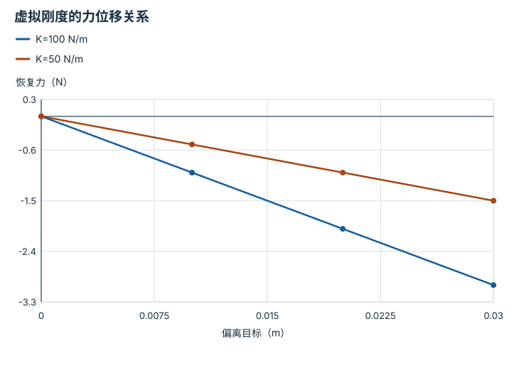
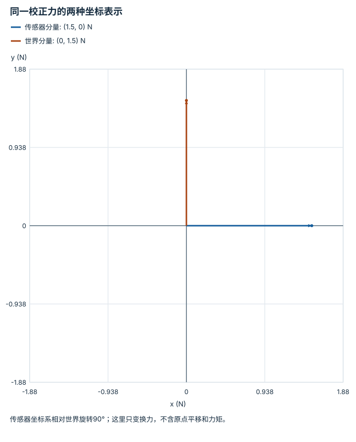

# 力、阻抗与柔顺交互：逐点细解

<!-- Generated by scripts/build_knowledge_atlas.py; edit knowledge/atlas/*.json. -->

[全部知识点](../index.md) · [返回原课程](../../foundations/08-control-basics.md)

Force, impedance, and compliant interaction · 本页拆成 **4 个小知识点**。

先阅读直觉和原理，再独立完成算例、自测；图是解释工具，不是已掌握或真机验证的证明。

## 前置知识

[反馈、轨迹与饱和](../system-feedback-control/index.md) → [接触、摩擦与抓取稳定性](../robot-contact-friction/index.md)

## 本页知识点

1. [阻抗：把偏离变成弹簧与阻尼力](#force-impedance-spring)
2. [导纳：把外力变成运动参考](#force-admittance-motion)
3. [混合力位控制：不同方向做不同事情](#force-hybrid-directions)
4. [读力之前：坐标系、偏置与重力](#force-frame-and-bias)

## 1. 阻抗：把偏离变成弹簧与阻尼力

**Impedance control**

**需要先懂：**力与位移、PD控制

### 一句话直觉

接触时不应只追求位置绝对不动；阻抗规定被推开后以怎样的力响应。

### 原理拆开看

1. 一维教学虚拟弹簧的偏离e=x−x目标，单位m，正e对应远离目标的正方向。
2. 恢复力F=−Ke−Bv；刚度K单位N/m，阻尼B单位N·s/m。
3. 刚度决定静态力位移斜率，阻尼决定对运动的响应；实际稳定性还依赖采样、接触和执行器。

### 手算或追踪一个例子

1. 教学输入K=100 N/m，B=0，偏离0.01、0.02、0.03 m。
2. 代入得到恢复力−1、−2、−3 N。
3. 相同0.02 m偏离若K减半，恢复力为−1 N；这说明柔顺程度改变而非定位精度得到保证。

### 用图理解

<figure class="atlas-visual" tabindex="0" aria-label="虚拟刚度的力位移关系；窄屏可在图内横向滚动">
<picture>
<source media="(max-width: 600px)" srcset="../../assets/knowledge-atlas/force-impedance-spring-mobile.svg">

</picture>
<figcaption>教学静态弹簧关系，不是接触稳定性试验。</figcaption>
</figure>

- 斜率绝对值越小，相同偏离产生的恢复力越小。
- 图中没有时间轴，不能推断振荡、摩擦或冲击峰值。

查看作图数据，自己复算

图上数值可能为便于阅读而取近似值，以下保留作图输入。线段的含义以本图图注和读图说明为准，不应自行解释为实测连续轨迹。

| 曲线 | 偏离目标（m） | 恢复力（N） |
| --- | --- | --- |
| K=100 N/m | 0 | 0 |
| K=100 N/m | 0.01 | -1 |
| K=100 N/m | 0.02 | -2 |
| K=100 N/m | 0.03 | -3 |
| K=50 N/m | 0 | 0 |
| K=50 N/m | 0.01 | -0.5 |
| K=50 N/m | 0.02 | -1 |
| K=50 N/m | 0.03 | -1.5 |

### 容易混淆的地方

**常见误解：**低刚度在任何接触中都更安全。

**为什么不成立：**负载支撑、阻尼、延迟和运动范围同样影响风险。

**正确理解：**这里只理解力位移关系，不据此选择真实机器人的参数。

### 自测

e=0而v=0.1 m/s、B=10 N·s/m时，恢复力一定为零吗？

展开答案与推理

不是；阻尼项产生−1 N，目标位置处仍可对速度制动。

**原始资料：**[Hogan: Impedance Control, Part I—Theory](https://doi.org/10.1115/1.3140702)

## 2. 导纳：把外力变成运动参考

**Admittance control**

**需要先懂：**速度积分、力测量

### 一句话直觉

一些系统只能接收位置或速度命令；导纳先根据测得的外力生成应该让开的运动。

### 原理拆开看

1. 教学一维虚拟质量M用kg、阻尼B用N·s/m，外力F用N。
2. 导纳模型M·dv/dt+Bv=F把力输入转为速度；这与位置误差到力的阻抗方向不同。
3. 再将速度积分成位置参考，交给已有运动控制器；测量偏置和内环延迟会影响整体行为。

### 手算或追踪一个例子

1. 教学输入M=2 kg、B=4 N·s/m、v=0，恒力F=2 N。
2. 初始加速度=(2−4×0)/2=1 m/s²；若持续恒力，稳态速度F/B=0.5 m/s。
3. 解析速度v(t)=0.5(1−exp(−2t))；t=0.5 s约0.316 m/s，t=1 s约0.432 m/s。

### 用图理解

<figure class="atlas-visual" tabindex="0" aria-label="恒力下的导纳速度；窄屏可在图内横向滚动">
<picture>
<source media="(max-width: 600px)" srcset="../../assets/knowledge-atlas/force-admittance-motion-mobile.svg">

</picture>
<figcaption>解析教学模型的稀疏采样，点间连线是示意。</figcaption>
</figure>

- 速度逐渐接近0.5 m/s而不是立即跳变。
- 这是虚拟参考速度，不是已测得的机器人末端响应。

查看作图数据，自己复算

图上数值可能为便于阅读而取近似值，以下保留作图输入。线段的含义以本图图注和读图说明为准，不应自行解释为实测连续轨迹。

| 曲线 | 时间（s） | 参考速度（m/s） |
| --- | --- | --- |
| M=2、B=4、F=2 | 0 | 0 |
| M=2、B=4、F=2 | 0.5 | 0.3161 |
| M=2、B=4、F=2 | 1 | 0.4323 |
| M=2、B=4、F=2 | 2 | 0.4908 |

### 容易混淆的地方

**常见误解：**导纳与阻抗只是同一个控制器换个名字。

**为什么不成立：**输入输出接口及依赖的内环不同，不能仅反转公式就保证等效。

**正确理解：**明确力传感器、虚拟动力学、位置/速度内环及限制。

### 自测

本模型取消阻尼B，恒力下还有0.5 m/s稳态吗？

展开答案与推理

没有；理想质量将持续加速，所以必须重新分析模型与限制。

**原始资料：**[Hogan: Impedance Control, Part I—Theory](https://doi.org/10.1115/1.3140702)

## 3. 混合力位控制：不同方向做不同事情

**Hybrid motion-force control**

**需要先懂：**坐标轴、接触约束

### 一句话直觉

沿桌面擦拭既要沿表面移动，又要维持法向接触，两个方向的目标不同。

### 原理拆开看

1. 教学二维接触坐标取x沿表面、z垂直表面；先固定这个接触坐标系。
2. 选择x方向跟踪位置，z方向控制接触力；互补选择矩阵分别取diag(1,0)与diag(0,1)。
3. 理想受约束方向不能同时任意指定独立位置和力；实际表面柔性会改变近似关系。

### 手算或追踪一个例子

1. 教学目标是沿x移动0.1 m，同时保持z方向力5 N；数字仅用于接口说明。
2. 把位置目标投影到x通道，把力目标投影到z通道。
3. 产生一个位移约束与一个力约束，而不是把0.1 m与5 N直接相加。

### 用图理解

<figure class="atlas-visual" tabindex="0" aria-label="位置任务的方向选择；窄屏可在图内横向滚动">
<picture>
<source media="(max-width: 600px)" srcset="../../assets/knowledge-atlas/force-hybrid-directions-mobile.svg">

</picture>
<figcaption>二维教学选择矩阵；力任务使用其互补矩阵。</figcaption>
</figure>

- x通道保留，z通道留给法向力任务。
- 这幅矩阵不包括接触检测、稳定性或硬件安全设计。

查看作图数据，自己复算

图上数值可能为便于阅读而取近似值，以下保留作图输入。

| 行 / 列 | 输入x | 输入z |
| --- | --- | --- |
| 输出x | 1 | 0 |
| 输出z | 0 | 0 |

### 容易混淆的地方

**常见误解：**六个方向同时采用很强的位置控制和力控制就更精确。

**为什么不成立：**在同一受约束方向上，独立目标可能互相冲突。

**正确理解：**基于接触约束与坐标系分配互补任务，再考虑模型误差。

### 自测

桌面倾斜后，仍把世界z轴当接触法向会怎样？

展开答案与推理

控制通道会混入切向和法向分量，应重新估计并变换接触方向。

**原始资料：**[Modern Robotics: Hybrid Motion-Force Control](https://modernrobotics.northwestern.edu/nu-gm-book-resource/11-6-hybrid-motion-force-control/)

## 4. 读力之前：坐标系、偏置与重力

**Force frames and bias compensation**

**需要先懂：**向量旋转、传感器校准

### 一句话直觉

腕部力传感器会随机器人旋转；相同世界外力会在传感器不同轴上出现。

### 原理拆开看

1. 二维教学测量Fs先减去已估计偏置b，两者单位N且位于同一传感器坐标系。
2. 再用从传感器到世界的旋转R得到Fw=R(Fs−b)。
3. 负载重力也会随姿态投影变化；六维wrench还包含力矩，变换原点时必须考虑力臂。

### 手算或追踪一个例子

1. 教学输入Fs=(2,0) N，偏置b=(0.5,0) N，传感器x轴相对世界逆时针90°。
2. 减偏置得(1.5,0) N，旋转后得到世界力(0,1.5) N。
3. 不减偏置会报告2 N；不旋转会把正确大小放在错误方向。

### 用图理解

<figure class="atlas-visual" tabindex="0" aria-label="同一校正力的两种坐标表示；窄屏可在图内横向滚动">
<picture>
<source media="(max-width: 600px)" srcset="../../assets/knowledge-atlas/force-frame-and-bias-mobile.svg">

</picture>
<figcaption>箭头画在公共示意原点，坐标变换不表示两个物理力同时作用。</figcaption>
</figure>

- 两箭头长度相同，说明旋转保留力大小。
- 方向改变来自坐标表达，不能把两箭头相加。

查看作图数据，自己复算

图上数值可能为便于阅读而取近似值，以下保留作图输入。

| 向量 | x (N) | y (N) |
| --- | --- | --- |
| 传感器分量 | 1.5 | 0 |
| 世界分量 | 0 | 1.5 |

### 容易混淆的地方

**常见误解：**静止时清零一次，就永远去除了负载重力。

**为什么不成立：**姿态变化后重力在传感器轴上的分量也改变。

**正确理解：**区分固定偏置与随姿态变化的负载项，并验证坐标约定。

### 自测

仅旋转力向量是否足以变换到另一个原点的六维力矩？

展开答案与推理

不够；力矩还包含原点平移产生的力臂叉乘项。

**原始资料：**[Modern Robotics: Wrenches](https://modernrobotics.northwestern.edu/nu-gm-book-resource/3-4-wrenches/)

## 从理解走向证据

本节点原有验收要求：在接触或力扰动下展示受限交互。

完成图解自测后，回到[原课程](../../foundations/08-control-basics.md)运行对应示例并保留证据；浏览页面和查看答案不会自动获得课程晋级。
