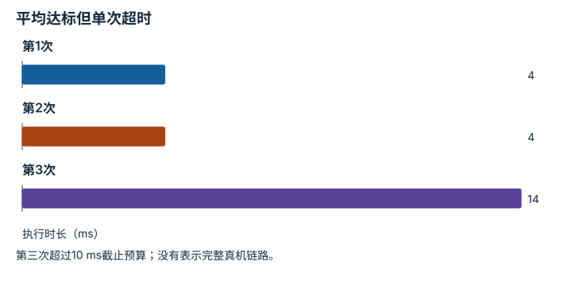
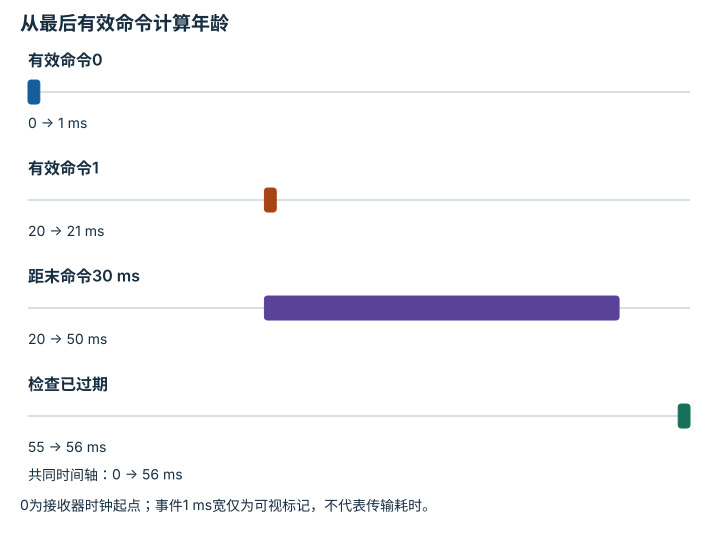
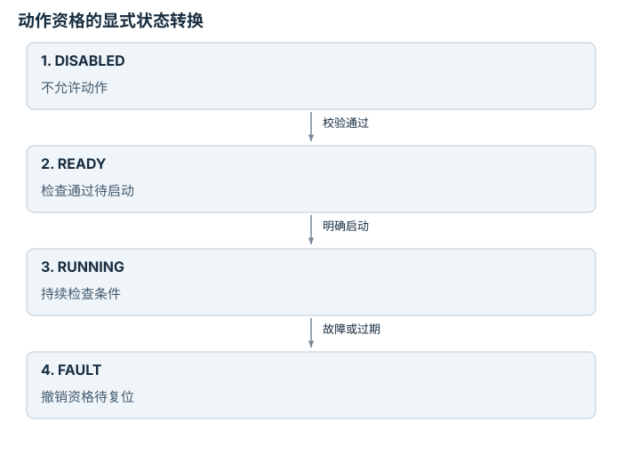
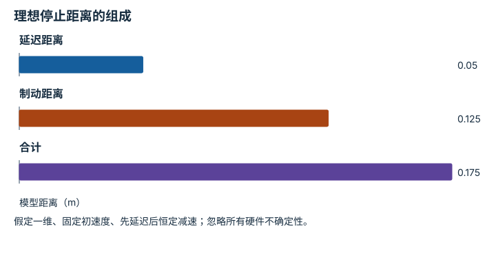

---
search:
  exclude: true
---

# 频率、看门狗、状态机与安全：逐点细解

<!-- Generated by scripts/build_knowledge_atlas.py; edit knowledge/atlas/*.json. -->

[按小节学习](../index.md) · [全部知识点](../../index.md) · [返回原课程](../../../foundations/13-robot-systems-and-safety.md)

Rates, watchdogs, state machines, and safety · 本页拆成 **4 个小知识点**。

先阅读直觉和原理，再独立完成算例、自测；图是解释工具，不是已掌握或真机验证的证明。

## 前置知识

[接口、配置与测试](../../computing-software-contracts/index.md) → [反馈、轨迹与饱和](../../system-feedback-control/index.md)

## 改一个参数试试看

比较推理完成时刻与末步观测年龄；实时安全还需要实际看门狗与停止路径。

[打开对应交互实验](../../../learning-lab-cn.md#timing)。滑块在文档站运行，GitHub 文件预览提供静态推导；不连接机器人。

## 本页知识点

1. [实时性：看截止时间，不只看平均速度](#realtime-deadline-jitter)
2. [看门狗：不把旧命令当成新命令](#realtime-watchdog-freshness)
3. [状态机：什么时候允许动作](#realtime-state-machine)
4. [停止有过程：延迟距离与制动距离](#realtime-stop-distance)

## 1. 实时性：看截止时间，不只看平均速度

**Deadlines and jitter**

**需要先懂：**时间戳、控制周期

### 一句话直觉

平均计算很快也可能偶尔错过控制窗口；延迟尾部会影响闭环使用的观测年龄。

### 原理拆开看

1. 周期T用ms，理想第i次任务在iT开始，并在下一周期前完成。
2. 计算时长加排队、传输和调度延迟才是端到端时间；平均值不包含最坏情况保证。
3. 记录每次完成时间与deadline比较，并统计抖动和超时；频率高不等于满足实时约束。

### 手算或追踪一个例子

1. 教学周期10 ms，三次执行时间为4、4、14 ms，先忽略排队。
2. 平均时长约7.33 ms，小于周期。
3. 第三次仍超时4 ms；只看平均值会遗漏一次deadline miss。

### 用图理解

<figure class="atlas-visual" tabindex="0" aria-label="平均达标但单次超时；窄屏可在图内横向滚动">
<picture>
<source media="(max-width: 600px)" srcset="../../../assets/knowledge-atlas/realtime-deadline-jitter-mobile.svg">

</picture>
<figcaption>三次教学执行时间；周期为10 ms。</figcaption>
</figure>

- 比较最高柱与10 ms预算，而不只比较柱高平均值。
- 三个样本不足以估计可靠的尾延迟分布。

查看作图数据，自己复算

图上数值可能为便于阅读而取近似值，以下保留作图输入。

| 项目 | 执行时长（ms） |
| --- | --- |
| 第1次 | 4 |
| 第2次 | 4 |
| 第3次 | 14 |

### 容易混淆的地方

**常见误解：**平均推理小于10 ms，就能宣称100 Hz端到端控制。

**为什么不成立：**推理只是链路一段，慢样本与其他延迟仍可能造成超时。

**正确理解：**报告完整时间戳、超时比例和运行条件。

### 自测

GPU推理4 ms、相机等待8 ms、传输2 ms，可直接称4 ms闭环吗？

展开答案与推理

不能；若三段串行则为14 ms，还未包括执行生效延迟。

**原始资料：**[ROS 2 Design: Real-time Programming](https://design.ros2.org/articles/realtime_background.html)

## 2. 看门狗：不把旧命令当成新命令

**Watchdog and command freshness**

**需要先懂：**单调时钟、通信延迟

### 一句话直觉

进程没崩溃不代表策略还在更新；看门狗需要判断最近有效信息是否已经过期。

### 原理拆开看

1. 教学接收器用同一单调时钟记录命令到达时刻t_last。
2. 每次检查计算年龄t_now−t_last，并验证序号是否递增，防止重复包刷新有效性。
3. 超过约定预算触发预定义的降级状态；具体停机策略应由硬件风险评估定义，不由本例阈值决定。

### 手算或追踪一个例子

1. 教学有效命令在0和20 ms到达，设示例过期预算30 ms。
2. 40 ms检查时年龄20 ms，仍在预算内。
3. 55 ms检查时年龄35 ms，判为过期；这证明有失联迹象，不证明机器人已经停止。

### 用图理解

<figure class="atlas-visual" tabindex="0" aria-label="从最后有效命令计算年龄；窄屏可在图内横向滚动">
<picture>
<source media="(max-width: 600px)" srcset="../../../assets/knowledge-atlas/realtime-watchdog-freshness-mobile.svg">

</picture>
<figcaption>单时钟教学时序，不是硬件超时配置建议。</figcaption>
</figure>

- 从20 ms而不是进程启动时刻计算当前命令年龄。
- 时间轴只有检测事件，没有证明机械停止。

查看作图数据，自己复算

图上数值可能为便于阅读而取近似值，以下保留作图输入。

| 事件 | 开始 (ms) | 结束 (ms) |
| --- | --- | --- |
| 有效命令0 | 0 | 1 |
| 有效命令1 | 20 | 21 |
| 距末命令30 ms | 20 | 50 |
| 检查已过期 | 55 | 56 |

### 容易混淆的地方

**常见误解：**看门狗触发日志等于完成安全停机。

**为什么不成立：**触发、发送降级命令和实际停止是不同事件。

**正确理解：**分别验证检测路径、独立安全执行路径和实际状态反馈。

### 自测

50 ms收到序号相同的旧包，是否应该延长有效控制寿命？

展开答案与推理

不应仅因到包刷新；需按协议确认新鲜性，重复旧包不能冒充新决策。

**原始资料：**[ROS 2 Design: QoS Deadline, Liveliness and Lifespan](https://design.ros2.org/articles/qos_deadline_liveliness_lifespan.html)

## 3. 状态机：什么时候允许动作

**Safety-oriented state machine**

**需要先懂：**布尔条件、事件日志

### 一句话直觉

连接设备、模型加载完成和允许机器人运动不是同一个状态，需要显式区分。

### 原理拆开看

1. 教学软件定义DISABLED、READY、RUNNING、FAULT四个离散状态。
2. 只有校验通过才能从DISABLED进入READY；只有明确启动事件且保护条件有效才能进入RUNNING。
3. 故障进入FAULT并撤销动作资格；恢复连接不自动恢复执行，需要记录原因和受控复位。

### 手算或追踪一个例子

1. 教学事件序列是加载配置、校验通过、显式启动、观测过期。
2. 状态依次为DISABLED、READY、RUNNING、FAULT。
3. 后续收到一张新图像仍停留FAULT，等待协议规定的确认与复位。

### 用图理解

<figure class="atlas-visual" tabindex="0" aria-label="动作资格的显式状态转换；窄屏可在图内横向滚动">
<picture>
<source media="(max-width: 600px)" srcset="../../../assets/knowledge-atlas/realtime-state-machine-mobile.svg">

</picture>
<figcaption>教学软件逻辑示例，不是认证安全控制器。</figcaption>
</figure>

- READY不是RUNNING，中间保留明确的启动门槛。
- 图未给出完整安全设计，不能替代风险评估和独立保护。

### 容易混淆的地方

**常见误解：**报错消失就应该自动继续上一条动作。

**为什么不成立：**机器人和环境可能已改变，旧动作不再适用。

**正确理解：**把故障恢复作为显式状态转换并重新验证条件。

### 自测

模型已加载但急停状态未知，是否可进入RUNNING？

展开答案与推理

不可以；未知保护条件不能视为通过，软件状态机也不能替代硬件急停。

**原始资料：**[ROS 2 Design: Managed Nodes](https://design.ros2.org/articles/node_lifecycle.html)

## 4. 停止有过程：延迟距离与制动距离

**Latency and stopping distance**

**需要先懂：**匀速运动、匀减速运动

### 一句话直觉

发出停止请求时物体不会瞬间静止；等待和减速都会继续消耗空间。

### 原理拆开看

1. 仅作一维运动学教学：初速度v用m/s，响应延迟τ用s，随后恒定减速度幅值a用m/s²。
2. 延迟期间前进vτ；制动阶段由速度平方关系得到距离v²/(2a)。
3. 两段相加只是理想模型；真实安全距离还涉及检测、负载、制动能力和标准要求，不能使用本例数值设计。

### 手算或追踪一个例子

1. 教学输入v=0.5 m/s、τ=0.1 s、a=1 m/s²。
2. 延迟距离0.05 m；制动距离0.25/2=0.125 m。
3. 总模型距离0.175 m；把速度翻倍至1 m/s时总距离变为0.1+0.5=0.6 m。

### 用图理解

<figure class="atlas-visual" tabindex="0" aria-label="理想停止距离的组成；窄屏可在图内横向滚动">
<picture>
<source media="(max-width: 600px)" srcset="../../../assets/knowledge-atlas/realtime-stop-distance-mobile.svg">

</picture>
<figcaption>仅为运动学教学，不构成安全距离建议。</figcaption>
</figure>

- 停止请求后的位移包含两部分，不能只算制动段。
- 未给出最坏故障或验证数据，不可把0.175 m用于布置真机防护。

查看作图数据，自己复算

图上数值可能为便于阅读而取近似值，以下保留作图输入。

| 项目 | 模型距离（m） |
| --- | --- |
| 延迟距离 | 0.05 |
| 制动距离 | 0.125 |
| 合计 | 0.175 |

### 容易混淆的地方

**常见误解：**速度翻倍，停止距离也只翻倍。

**为什么不成立：**固定减速度模型中的制动项与速度平方成正比。

**正确理解：**拆分响应延迟与制动过程，并把真实安全判断交给验证过的系统规格与风险评估。

### 自测

在原算例把延迟减半，停止距离变成多少？

展开答案与推理

0.025+0.125=0.15 m；只减少延迟项，制动距离不变。

**原始资料：**[OSHA Technical Manual: Industrial Robot Systems and Safety](https://www.osha.gov/otm/section-4-safety-hazards/chapter-4)

## 从理解走向证据

本节点原有验收要求：注入故障并验证系统进入预期的受限状态。

完成图解自测后，回到[原课程](../../../foundations/13-robot-systems-and-safety.md)运行对应示例并保留证据；浏览页面和查看答案不会自动获得课程晋级。
