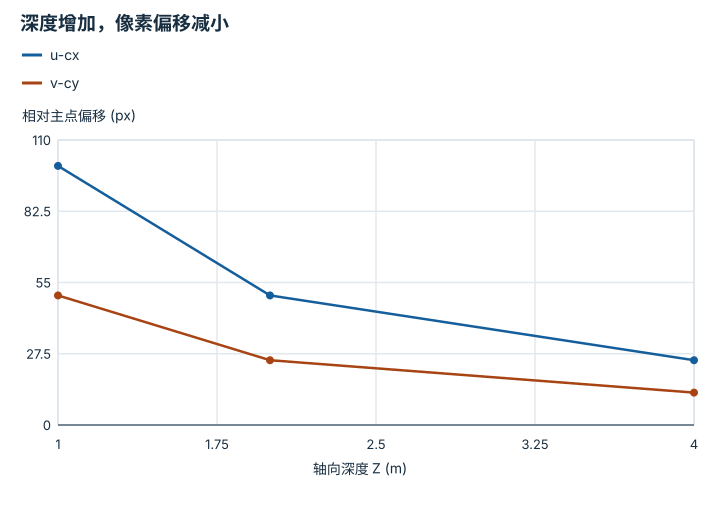
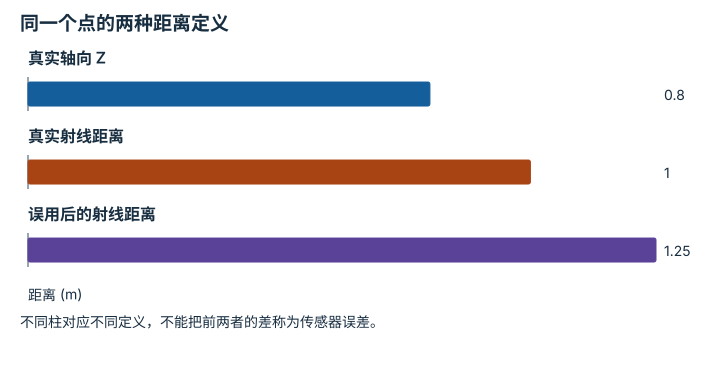
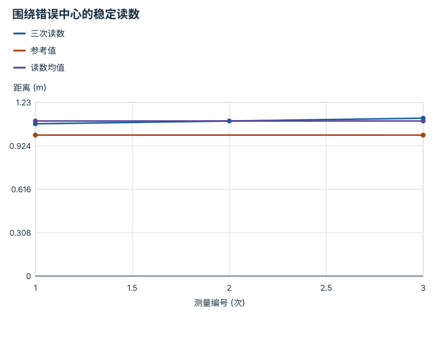
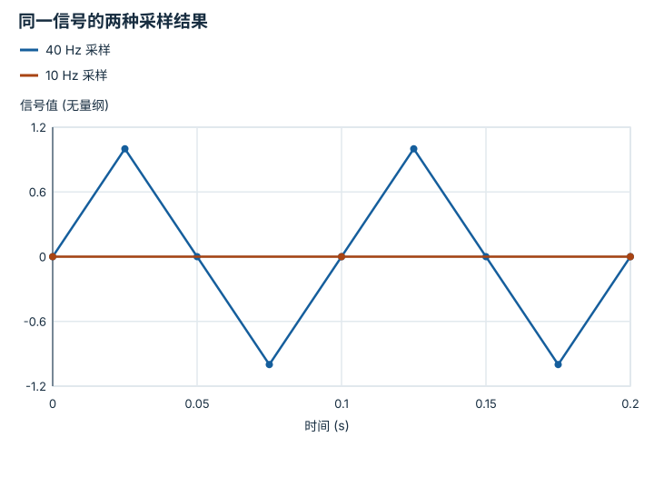

---
search:
  exclude: true
---

# 传感器模型与观测语义：逐点细解

<!-- Generated by scripts/build_knowledge_atlas.py; edit knowledge/atlas/*.json. -->

[按小节学习](../index.md) · [全部知识点](../../index.md) · [返回原课程](../../../foundations/12-perception-and-sensors.md)

Sensor models and observation semantics · 本页拆成 **4 个小知识点**。

先阅读直觉和原理，再独立完成算例、自测；图是解释工具，不是已掌握或真机验证的证明。

## 前置知识

[概率、估计与不确定性](../../math-probability-statistics/index.md) → [坐标系与变换链](../../robot-coordinate-frames/index.md)

## 本页知识点

1. [像素位置来自横向距离除以深度](#sensor-pinhole-projection)
2. [轴向深度与射线距离不能混用](#sensor-depth-versus-range)
3. [平均能减噪，却不能自动去偏差](#sensor-bias-noise)
4. [采样太慢会把真实振荡看成静止](#sensor-sampling-aliasing)

## 1. 像素位置来自横向距离除以深度

**Pinhole camera projection**

**需要先懂：**相似三角形、相机坐标系

### 一句话直觉

同样向右偏 0.2 m，近处物体在图像中偏得更多，远处物体偏得更少。

### 原理拆开看

1. 本例相机坐标 X 向右、Y 向下、Z 向前，点必须有 Z>0；不考虑镜头畸变。
2. 归一化成像坐标为 X/Z、Y/Z，再用像素焦距 fx、fy 和主点 cx、cy 转为像素。
3. 公式 u=fx X/Z+cx、v=fy Y/Z+cy；单个像素仅提供一条射线，不自动给出深度。

### 手算或追踪一个例子

1. 教学 fx=fy=500 px，主点 (320,240) px，点 (X,Y,Z)=(0.2,0.1,2) m。
2. u=500×0.2/2+320=370 px；v=500×0.1/2+240=265 px。
3. 保持 X、Y 不变，Z=1、2、4 m 时横向像素偏移分别为 100、50、25 px，纵向为 50、25、12.5 px。

### 用图理解

<figure class="atlas-visual" tabindex="0" aria-label="深度增加，像素偏移减小；窄屏可在图内横向滚动">
<picture>
<source media="(max-width: 600px)" srcset="../../../assets/knowledge-atlas/sensor-pinhole-projection-mobile.svg">

</picture>
<figcaption>教学示意，非实测；稀疏点间连线仅辅助阅读，真实关系为反比例曲线。</figcaption>
</figure>

- Z 翻倍时偏移减半，但这要求 X、Y 固定而不是整个三维点同比缩放。
- 图不包含畸变、遮挡和深度噪声，不能直接评价相机精度。

查看作图数据，自己复算

图上数值可能为便于阅读而取近似值，以下保留作图输入。线段的含义以本图图注和读图说明为准，不应自行解释为实测连续轨迹。

| 曲线 | 轴向深度 Z (m) | 相对主点偏移 (px) |
| --- | --- | --- |
| u-cx | 1 | 100 |
| u-cx | 2 | 50 |
| u-cx | 4 | 25 |
| v-cy | 1 | 50 |
| v-cy | 2 | 25 |
| v-cy | 4 | 12.5 |

### 容易混淆的地方

**常见误解：**知道像素坐标就知道三维位置。

**为什么不成立：**沿同一射线按比例放大 X、Y、Z，投影保持相同。

**正确理解：**还需深度、多视角、已知几何或其他约束才能恢复尺度。

### 自测

点 (0.4,0.2,4) m 投影会改变吗？

展开答案与推理

不会，X/Z 与 Y/Z 都不变，所以仍为 (370,265) px；这体现单目射线的深度歧义。

**原始资料：**[OpenCV camera calibration and pinhole model](https://docs.opencv.org/4.x/d9/d0c/group__calib3d.html)

## 2. 轴向深度与射线距离不能混用

**Depth versus range**

**需要先懂：**针孔投影、向量范数

### 一句话直觉

深度图中的一个数有时是 Z，有时是到传感器的距离；不确认定义就反投影，会让点云形状扭曲。

### 原理拆开看

1. 轴向深度 Z 是点沿相机前向轴的分量；射线距离 ρ=√(X²+Y²+Z²)。
2. 已知像素归一化方向 (xn,yn,1) 时，用 Z 直接乘它即可得到三维点。
3. 若读数是 ρ，则必须先把方向归一化，再乘 ρ；不能把 ρ 当作 Z。

### 手算或追踪一个例子

1. 教学点 P=(0.6,0,0.8) m，轴向 Z=0.8 m。
2. 射线距离 ρ=√(0.36+0.64)=1 m；归一化图像方向为 (0.75,0,1)。
3. 用 Z 反投影得 (0.6,0,0.8) m；误把 ρ=1 当 Z，会得到 (0.75,0,1) m，距离变成 1.25 m。

### 用图理解

<figure class="atlas-visual" tabindex="0" aria-label="同一个点的两种距离定义；窄屏可在图内横向滚动">
<picture>
<source media="(max-width: 600px)" srcset="../../../assets/knowledge-atlas/sensor-depth-versus-range-mobile.svg">

</picture>
<figcaption>教学示意，非实测；第三根柱为错误反投影结果。</figcaption>
</figure>

- 0.8 与 1 同时正确，因为测量方向不同。
- 1.25 才来自本例语义混用；更远并不代表更高分辨率。

查看作图数据，自己复算

图上数值可能为便于阅读而取近似值，以下保留作图输入。

| 项目 | 距离 (m) |
| --- | --- |
| 真实轴向 Z | 0.8 |
| 真实射线距离 | 1 |
| 误用后的射线距离 | 1.25 |

### 容易混淆的地方

**常见误解：**所有标注 depth 的接口都输出同一种距离。

**为什么不成立：**传感器和数据集可能采用不同约定，轴外像素尤其容易出现差异。

**正确理解：**查明深度定义、比例和无效值，再用已知几何点测试反投影。

### 自测

什么情况下 Z 与 ρ 相等？

展开答案与推理

点位于相机正前方光轴上，即 X=Y=0 且 Z≥0；轴外一般有 ρ>Z。

**原始资料：**[OpenCV camera coordinate and projection model](https://docs.opencv.org/4.x/d9/d0c/group__calib3d.html)

## 3. 平均能减噪，却不能自动去偏差

**Bias and measurement noise**

**需要先懂：**均值与方差、校准参考

### 一句话直觉

每次测量都很接近，却总比尺子长 0.1 m，说明重复性好不等于测量准确。

### 原理拆开看

1. 简化测量模型 y=x+b+ε：x 为真实量，b 为固定偏差，ε 为零均值随机噪声。
2. 若噪声独立且同方差，多次平均会缩小均值的噪声方差，但常数 b 不会被平均掉。
3. 需要参考标准或其他可辨识信息估计偏差；不能从重复性单独推断准确度。

### 手算或追踪一个例子

1. 教学参考距离 x=1 m，三次读数为 [1.08,1.10,1.12] m。
2. 均值为 1.10 m，相对参考偏差估计为 +0.10 m。
3. 中心化残差为 [-0.02,0,0.02] m，样本标准差为 0.02 m；散布比偏差小，但二者含义不同。

### 用图理解

<figure class="atlas-visual" tabindex="0" aria-label="围绕错误中心的稳定读数；窄屏可在图内横向滚动">
<picture>
<source media="(max-width: 600px)" srcset="../../../assets/knowledge-atlas/sensor-bias-noise-mobile.svg">

</picture>
<figcaption>教学示意，非实测；编号之间的连线不表示连续运动。</figcaption>
</figure>

- 读数到均值的差是波动，均值到参考线的差是偏差估计。
- 仅三个教学读数不足以描述长时间漂移或真实误差分布。

查看作图数据，自己复算

图上数值可能为便于阅读而取近似值，以下保留作图输入。线段的含义以本图图注和读图说明为准，不应自行解释为实测连续轨迹。

| 曲线 | 测量编号 (次) | 距离 (m) |
| --- | --- | --- |
| 三次读数 | 1 | 1.08 |
| 三次读数 | 2 | 1.1 |
| 三次读数 | 3 | 1.12 |
| 参考值 | 1 | 1 |
| 参考值 | 3 | 1 |
| 读数均值 | 1 | 1.1 |
| 读数均值 | 3 | 1.1 |

### 容易混淆的地方

**常见误解：**读数越集中，离真实值就一定越近。

**为什么不成立：**稳定的系统偏差可以使所有读数集中在错误位置。

**正确理解：**分别报告偏差、重复性和参考标准不确定性。

### 自测

三次读数都精确为 1.10 m，是否说明无误差？

展开答案与推理

不是；样本散布为零，但相对 1 m 参考仍有 +0.10 m 偏差。

**原始资料：**[NIST: bias and accuracy](https://www.itl.nist.gov/div898/handbook/mpc/section1/mpc113.htm)

## 4. 采样太慢会把真实振荡看成静止

**Sampling and aliasing**

**需要先懂：**频率与周期、正弦函数

### 一句话直觉

视频里轮子似乎倒转，或传感器看不到振动，可能是采样造成的假象。

### 原理拆开看

1. 连续信号在离散时间点被观测；采样率 fs 决定间隔 Δt=1/fs。
2. 高于可辨识频带的成分可能混叠成低频；对带限信号，采样率应高于最高频率的两倍，并配合合适抗混叠处理。
3. 采样相位也影响看到的值；采样点全相同不证明连续信号没有变化。

### 手算或追踪一个例子

1. 教学 x(t)=sin(2π×10t)，幅度无量纲、频率 10 Hz。
2. 以 10 Hz 在 t=0、0.1、0.2 s 采样，三个值全部为 0。
3. 以 40 Hz 在 0、0.025、0.05、0.075、0.1 s 采样，依次为 0、1、0、-1、0，能看到振荡。

### 用图理解

<figure class="atlas-visual" tabindex="0" aria-label="同一信号的两种采样结果；窄屏可在图内横向滚动">
<picture>
<source media="(max-width: 600px)" srcset="../../../assets/knowledge-atlas/sensor-sampling-aliasing-mobile.svg">

</picture>
<figcaption>教学示意，非实测；连线连接离散样本，不是原正弦的精确曲线。</figcaption>
</figure>

- 慢采样线是平的，但快采样已经揭示其中的正负峰值。
- 这只展示一个无噪声正弦，真实多频信号需要频谱和滤波设计。

查看作图数据，自己复算

图上数值可能为便于阅读而取近似值，以下保留作图输入。线段的含义以本图图注和读图说明为准，不应自行解释为实测连续轨迹。

| 曲线 | 时间 (s) | 信号值 (无量纲) |
| --- | --- | --- |
| 40 Hz 采样 | 0 | 0 |
| 40 Hz 采样 | 0.025 | 1 |
| 40 Hz 采样 | 0.05 | 0 |
| 40 Hz 采样 | 0.075 | -1 |
| 40 Hz 采样 | 0.1 | 0 |
| 40 Hz 采样 | 0.125 | 1 |
| 40 Hz 采样 | 0.15 | 0 |
| 40 Hz 采样 | 0.175 | -1 |
| 40 Hz 采样 | 0.2 | 0 |
| 10 Hz 采样 | 0 | 0 |
| 10 Hz 采样 | 0.1 | 0 |
| 10 Hz 采样 | 0.2 | 0 |

### 容易混淆的地方

**常见误解：**采到相同值就能证明目标没有运动。

**为什么不成立：**采样可能总落在同一相位，未观测到中间变化。

**正确理解：**根据信号带宽选择采样率，并检查时间戳、滤波与曝光等因素。

### 自测

若用 20 Hz 且仍从 t=0 开始，是否必然看清这个正弦？

展开答案与推理

不一定，本例仍会采在每半周期的零点；采样恰好等于两倍频率并不能对任意相位稳健重建。

**原始资料：**[MIT Signals and Systems: Sampling](https://ocw.mit.edu/courses/res-6-007-signals-and-systems-spring-2011/resources/lecture-16-sampling/)

## 从理解走向证据

本节点原有验收要求：为一套传感器写出完整观测协议。

完成图解自测后，回到[原课程](../../../foundations/12-perception-and-sensors.md)运行对应示例并保留证据；浏览页面和查看答案不会自动获得课程晋级。
