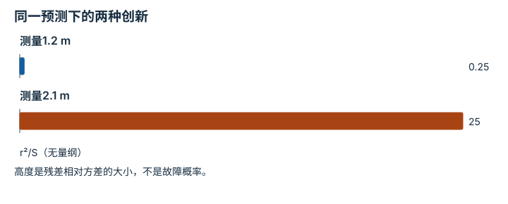

---
hide:
  - navigation
---

<!-- Generated by scripts/build_knowledge_atlas.py; edit knowledge/atlas/*.json. -->

<nav class="study-breadcrumb" aria-label="学习位置" markdown="1">
[知识目录](../../index.md) / [滤波、融合与状态估计](../index.md)
</nav>

L2 · 本章第 2 / 4 节

# 创新量：新读数与预测差多少

**Innovation and residual**

融合前先问传感器带来了多少意外；异常的大残差可能意味着遮挡、时间错位或模型错误。

先确认：这些前置知识我懂了吗？

运动预测、方差

[标定与时间同步](../../system-calibration-synchronization/index.md) · [概率、估计与不确定性](../../math-probability-statistics/index.md)

<section class="study-section " markdown="1">

## 1 · 原理拆开看

1. 位置测量 z 与预测 x−必须对应同一时刻、同一坐标系，单位均为 m。
2. 创新量 r=z−x−；独立测量噪声方差 R 与预测方差 P−相加得到 S=P−+R。
3. r²/S 是无量纲归一化创新平方；阈值应来自噪声假设与误报预算，不能任意指定为安全保证。

</section>

<section class="study-section " markdown="1">

## 2 · 跟着例子算一遍

1. 教学输入 x−=1.1 m，P−=0.01 m²，R=0.03 m²；比较测量1.2 m和2.1 m。
2. S=0.04 m²；两个创新量分别为0.1 m和1 m。
3. 归一化创新平方分别为0.25和25；第二个读数更不符合当前不确定性模型，应检查原因。

</section>

<section class="study-section " markdown="1">

## 3 · 对照图，解释变化

<figure class="atlas-visual" tabindex="0" aria-label="同一预测下的两种创新；窄屏可在图内横向滚动">
<picture>
<source media="(max-width: 600px)" srcset="../../../assets/knowledge-atlas/estimate-innovation-mobile.svg">

</picture>
<figcaption>教学读数与同一噪声模型的数值比较。</figcaption>
</figure>

- 25远大于0.25，说明第二条测量与先验更不一致。
- 柱高不能区分传感器错误和运动模型失配。

查看作图数据，自己复算

图上数值可能为便于阅读而取近似值，以下保留作图输入。

| 项目 | r²/S（无量纲） |
| --- | --- |
| 测量1.2 m | 0.25 |
| 测量2.1 m | 25 |

</section>

<section class="study-section study-misconception" markdown="1">

## 4 · 避开一个误区

**容易误以为：**残差大就证明传感器坏了。

**为什么不成立：**模型、坐标系和时间戳错误也能产生大残差。

**正确理解：**把残差作为诊断信号，检查多种原因后再决定是否拒绝观测。

</section>

<section class="study-section study-check" markdown="1">

## 5 · 先独立回答

相同0.1 m残差，S从0.04变成0.01 m²意味着什么？

我已作答，查看推理

归一化创新平方从0.25增至1；模型声称更确定，因此同样偏差显得更意外。

</section>

继续查阅原始资料

- [Kalman: Linear Filtering and Prediction](https://doi.org/10.1115/1.3662552)

<nav class="study-pagination" aria-label="相邻小节" markdown="1">

[← 预测步骤：两次测量之间发生了什么](../estimate-motion-prediction/index.md)

[卡尔曼增益：该信测量多少 →](../estimate-kalman-gain/index.md)

</nav>

[返回本章目录](../index.md) · [整章连续阅读](../complete/index.md)

本章最后需要提交什么？

在受控扰动下比较估计误差与不确定性。

回到[原课程](../../../pipelines/09-perception-state-estimation.md)完成实践。阅读位置或查看答案不计为通过验收。

