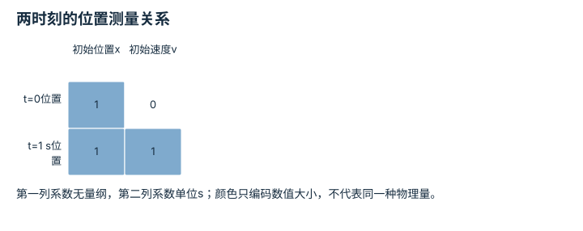

---
hide:
  - navigation
---

<!-- Generated by scripts/build_knowledge_atlas.py; edit knowledge/atlas/*.json. -->

<nav class="study-breadcrumb" aria-label="学习位置" markdown="1">
[知识目录](../../index.md) / [滤波、融合与状态估计](../index.md)
</nav>

L2 · 本章第 4 / 4 节

# 可观测性：看不到的量能否推出来

**Observability**

单次位置测量看不到速度，但连续两次位置与运动模型一起可能揭示速度。

先确认：这些前置知识我懂了吗？

矩阵乘法、位置与速度

[标定与时间同步](../../system-calibration-synchronization/index.md) · [概率、估计与不确定性](../../math-probability-statistics/index.md)

<section class="study-section " markdown="1">

## 1 · 原理拆开看

1. 教学状态为[x,v]，位置用m、速度用m/s；无加速度且采样间隔1 s。
2. 一次位置观测的测量行是[1,0]；下一次位置对初态的测量行为[1,1]，第二列系数具有s单位。
3. 把两个时刻的信息堆叠；两行独立时能在无噪声模型中解出两个初始未知量。

</section>

<section class="study-section " markdown="1">

## 2 · 跟着例子算一遍

1. 教学观测为t=0时位置2 m、t=1 s时位置2.5 m。
2. 由第一行得x=2 m；第二行给出2+v×1=2.5。
3. 得到v=0.5 m/s；若两次测量都在t=0，重复行不能提供速度信息。

</section>

<section class="study-section " markdown="1">

## 3 · 对照图，解释变化

<figure class="atlas-visual" tabindex="0" aria-label="两时刻的位置测量关系；窄屏可在图内横向滚动">
<picture>
<source media="(max-width: 600px)" srcset="../../../assets/knowledge-atlas/estimate-observability-mobile.svg">

</picture>
<figcaption>状态分量单位不同，矩阵单元应结合列单位读。</figcaption>
</figure>

- 第二行新增速度系数，提供第一行没有的信息。
- 满秩只说明此线性无噪声模型可解，不说明实际估计足够精确。

查看作图数据，自己复算

图上数值可能为便于阅读而取近似值，以下保留作图输入。

| 行 / 列 | 初始位置x | 初始速度v |
| --- | --- | --- |
| t=0位置 | 1 | 0 |
| t=1 s位置 | 1 | 1 |

</section>

<section class="study-section study-misconception" markdown="1">

## 4 · 避开一个误区

**容易误以为：**估计器输出了速度，就说明速度被可靠观测到了。

**为什么不成立：**输出也可能主要来自先验或约束。

**正确理解：**检查测量与运动是否为该状态提供独立信息，以及噪声下的条件数。

</section>

<section class="study-section study-check" markdown="1">

## 5 · 先独立回答

把两次观测间隔缩成0.001 s，数学上可解就一定准确吗？

我已作答，查看推理

不一定；速度由位置差除以很小时间间隔得到，位置噪声会被显著放大。

</section>

继续查阅原始资料

- [MIT Underactuated Robotics: State Estimation](https://underactuated.mit.edu/state_estimation.html)

<nav class="study-pagination" aria-label="相邻小节" markdown="1">

[← 卡尔曼增益：该信测量多少](../estimate-kalman-gain/index.md)

[回原课程动手验证 →](../../../pipelines/09-perception-state-estimation.md)

</nav>

[返回本章目录](../index.md) · [整章连续阅读](../complete/index.md)

本章最后需要提交什么？

在受控扰动下比较估计误差与不确定性。

回到[原课程](../../../pipelines/09-perception-state-estimation.md)完成实践。阅读位置或查看答案不计为通过验收。

