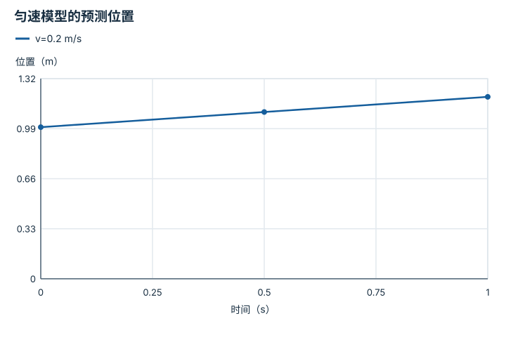
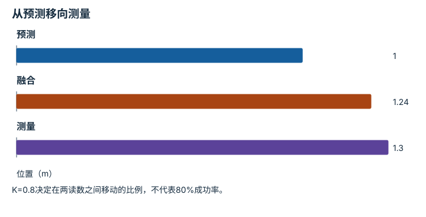

# 滤波、融合与状态估计：逐点细解

<!-- Generated by scripts/build_knowledge_atlas.py; edit knowledge/atlas/*.json. -->

[全部知识点](../index.md) · [返回原课程](../../pipelines/09-perception-state-estimation.md)

Filtering, fusion, and state estimation · 本页拆成 **4 个小知识点**。

先阅读直觉和原理，再独立完成算例、自测；图是解释工具，不是已掌握或真机验证的证明。

## 前置知识

[标定与时间同步](../system-calibration-synchronization/index.md) → [概率、估计与不确定性](../math-probability-statistics/index.md)

## 本页知识点

1. [预测步骤：两次测量之间发生了什么](#estimate-motion-prediction)
2. [创新量：新读数与预测差多少](#estimate-innovation)
3. [卡尔曼增益：该信测量多少](#estimate-kalman-gain)
4. [可观测性：看不到的量能否推出来](#estimate-observability)

## 1. 预测步骤：两次测量之间发生了什么

**Motion prediction**

**需要先懂：**位置、速度与单位、方差

### 一句话直觉

相机没有新帧时，机器人仍在运动；预测用运动模型填补空档，同时承认模型会出错。

### 原理拆开看

1. 一维教学状态为位置 x，单位 m；已知速度 v，单位 m/s，采样间隔 Δt 用 s。
2. 匀速假设给出下一时刻预测 x−=x+vΔt；这不是新的传感器读数。
3. 标量位置方差 P 用 m²；若独立过程噪声方差为 Q，则本简化模型 P−=P+Q。

### 手算或追踪一个例子

1. 教学输入 x=1 m、v=0.2 m/s、Δt=0.5 s，P=0.01 m²、Q=0.0025 m²。
2. 计算位移 0.2×0.5=0.1 m，预测位置为 1.1 m。
3. 预测方差为 0.0125 m²；标准差约 0.112 m，说明等待新观测时不确定性增大。

### 用图理解

<figure class="atlas-visual" tabindex="0" aria-label="匀速模型的预测位置；窄屏可在图内横向滚动">
<picture>
<source media="(max-width: 600px)" srcset="../../assets/knowledge-atlas/estimate-motion-prediction-mobile.svg">

</picture>
<figcaption>教学模型在固定速度假设下的计算，不是跟踪精度实测。</figcaption>
</figure>

- 横轴前进0.5 s，纵轴增加0.1 m，斜率对应速度。
- 图未画测量和不确定性，不能据此判断真实机器人误差。

查看作图数据，自己复算

图上数值可能为便于阅读而取近似值，以下保留作图输入。线段的含义以本图图注和读图说明为准，不应自行解释为实测连续轨迹。

| 曲线 | 时间（s） | 位置（m） |
| --- | --- | --- |
| v=0.2 m/s | 0 | 1 |
| v=0.2 m/s | 0.5 | 1.1 |
| v=0.2 m/s | 1 | 1.2 |

### 容易混淆的地方

**常见误解：**预测曲线平滑，所以比测量更真实。

**为什么不成立：**平滑来自模型假设，碰撞或速度改变可能使预测偏离。

**正确理解：**把预测当作带不确定性的先验，再用新观测检验。

### 自测

保持其他量不变，Δt=1 s时预测位置是多少？方差一定翻倍吗？

展开答案与推理

位置为1.2 m；方差不能据此直接翻倍，必须说明过程噪声如何随时间离散化。

**原始资料：**[Kalman: A New Approach to Linear Filtering and Prediction Problems](https://doi.org/10.1115/1.3662552)

## 2. 创新量：新读数与预测差多少

**Innovation and residual**

**需要先懂：**运动预测、方差

### 一句话直觉

融合前先问传感器带来了多少意外；异常的大残差可能意味着遮挡、时间错位或模型错误。

### 原理拆开看

1. 位置测量 z 与预测 x−必须对应同一时刻、同一坐标系，单位均为 m。
2. 创新量 r=z−x−；独立测量噪声方差 R 与预测方差 P−相加得到 S=P−+R。
3. r²/S 是无量纲归一化创新平方；阈值应来自噪声假设与误报预算，不能任意指定为安全保证。

### 手算或追踪一个例子

1. 教学输入 x−=1.1 m，P−=0.01 m²，R=0.03 m²；比较测量1.2 m和2.1 m。
2. S=0.04 m²；两个创新量分别为0.1 m和1 m。
3. 归一化创新平方分别为0.25和25；第二个读数更不符合当前不确定性模型，应检查原因。

### 用图理解

<figure class="atlas-visual" tabindex="0" aria-label="同一预测下的两种创新；窄屏可在图内横向滚动">
<picture>
<source media="(max-width: 600px)" srcset="../../assets/knowledge-atlas/estimate-innovation-mobile.svg">

</picture>
<figcaption>教学读数与同一噪声模型的数值比较。</figcaption>
</figure>

- 25远大于0.25，说明第二条测量与先验更不一致。
- 柱高不能区分传感器错误和运动模型失配。

查看作图数据，自己复算

图上数值可能为便于阅读而取近似值，以下保留作图输入。

| 项目 | r²/S（无量纲） |
| --- | --- |
| 测量1.2 m | 0.25 |
| 测量2.1 m | 25 |

### 容易混淆的地方

**常见误解：**残差大就证明传感器坏了。

**为什么不成立：**模型、坐标系和时间戳错误也能产生大残差。

**正确理解：**把残差作为诊断信号，检查多种原因后再决定是否拒绝观测。

### 自测

相同0.1 m残差，S从0.04变成0.01 m²意味着什么？

展开答案与推理

归一化创新平方从0.25增至1；模型声称更确定，因此同样偏差显得更意外。

**原始资料：**[Kalman: Linear Filtering and Prediction](https://doi.org/10.1115/1.3662552)

## 3. 卡尔曼增益：该信测量多少

**Scalar Kalman gain**

**需要先懂：**创新量、独立噪声

### 一句话直觉

融合不是永远取平均；不确定性更小的信息应在符合模型假设时获得更大权重。

### 原理拆开看

1. 本例测量直接观察标量位置，噪声零均值、互相独立，方差单位均为 m²。
2. 增益 K=P−/(P−+R)，用 x+=x−+K(z−x−)修正预测。
3. 后验方差 P+=(1−K)P−；多维系统需矩阵公式，不能逐项任意平均。

### 手算或追踪一个例子

1. 教学输入预测1 m、P−=0.04 m²，测量1.3 m、R=0.01 m²。
2. K=0.04/0.05=0.8，创新量0.3 m，修正量0.24 m。
3. 融合位置1.24 m，P+=0.008 m²；它更靠近较精确的测量。

### 用图理解

<figure class="atlas-visual" tabindex="0" aria-label="从预测移向测量；窄屏可在图内横向滚动">
<picture>
<source media="(max-width: 600px)" srcset="../../assets/knowledge-atlas/estimate-kalman-gain-mobile.svg">

</picture>
<figcaption>同一时刻的一维位置融合算例。</figcaption>
</figure>

- 融合比预测更接近1.3 m测量。
- 图不包含真实位置；更接近测量不等于证明更准确。

查看作图数据，自己复算

图上数值可能为便于阅读而取近似值，以下保留作图输入。

| 项目 | 位置（m） |
| --- | --- |
| 预测 | 1 |
| 融合 | 1.24 |
| 测量 | 1.3 |

### 容易混淆的地方

**常见误解：**两传感器融合后方差必定按独立公式下降。

**为什么不成立：**它们可能共用同一图像或先验，误差相关时会重复计算证据。

**正确理解：**明确相关性与噪声模型，避免过度自信。

### 自测

若R也为0.04 m²，融合结果是多少？

展开答案与推理

K=0.5，位置变为1.15 m；这次等权平均来自相等且独立的方差假设。

**原始资料：**[Kalman: Linear Filtering and Prediction](https://doi.org/10.1115/1.3662552)

## 4. 可观测性：看不到的量能否推出来

**Observability**

**需要先懂：**矩阵乘法、位置与速度

### 一句话直觉

单次位置测量看不到速度，但连续两次位置与运动模型一起可能揭示速度。

### 原理拆开看

1. 教学状态为[x,v]，位置用m、速度用m/s；无加速度且采样间隔1 s。
2. 一次位置观测的测量行是[1,0]；下一次位置对初态的测量行为[1,1]，第二列系数具有s单位。
3. 把两个时刻的信息堆叠；两行独立时能在无噪声模型中解出两个初始未知量。

### 手算或追踪一个例子

1. 教学观测为t=0时位置2 m、t=1 s时位置2.5 m。
2. 由第一行得x=2 m；第二行给出2+v×1=2.5。
3. 得到v=0.5 m/s；若两次测量都在t=0，重复行不能提供速度信息。

### 用图理解

<figure class="atlas-visual" tabindex="0" aria-label="两时刻的位置测量关系；窄屏可在图内横向滚动">
<picture>
<source media="(max-width: 600px)" srcset="../../assets/knowledge-atlas/estimate-observability-mobile.svg">

</picture>
<figcaption>状态分量单位不同，矩阵单元应结合列单位读。</figcaption>
</figure>

- 第二行新增速度系数，提供第一行没有的信息。
- 满秩只说明此线性无噪声模型可解，不说明实际估计足够精确。

查看作图数据，自己复算

图上数值可能为便于阅读而取近似值，以下保留作图输入。

| 行 / 列 | 初始位置x | 初始速度v |
| --- | --- | --- |
| t=0位置 | 1 | 0 |
| t=1 s位置 | 1 | 1 |

### 容易混淆的地方

**常见误解：**估计器输出了速度，就说明速度被可靠观测到了。

**为什么不成立：**输出也可能主要来自先验或约束。

**正确理解：**检查测量与运动是否为该状态提供独立信息，以及噪声下的条件数。

### 自测

把两次观测间隔缩成0.001 s，数学上可解就一定准确吗？

展开答案与推理

不一定；速度由位置差除以很小时间间隔得到，位置噪声会被显著放大。

**原始资料：**[MIT Underactuated Robotics: State Estimation](https://underactuated.mit.edu/state_estimation.html)

## 从理解走向证据

本节点原有验收要求：在受控扰动下比较估计误差与不确定性。

完成图解自测后，回到[原课程](../../pipelines/09-perception-state-estimation.md)运行对应示例并保留证据；浏览页面和查看答案不会自动获得课程晋级。
