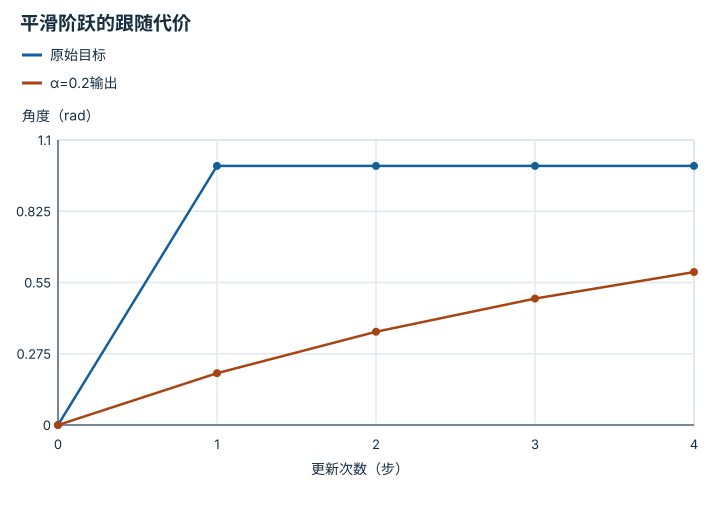

---
hide:
  - navigation
---

<!-- Generated by scripts/build_knowledge_atlas.py; edit knowledge/atlas/*.json. -->

<nav class="study-breadcrumb" aria-label="学习位置" markdown="1">
[知识目录](../../index.md) / [灵巧操作、重定向与遥操作](../index.md)
</nav>

L4 · 本章第 3 / 4 节

# 滤波降低抖动，同时引入跟随滞后

**Smoothing versus lag**

画面更平滑不一定更及时，遥操作要同时看噪声与延迟。

先确认：这些前置知识我懂了吗？

加权平均、离散时间

[正运动学、Jacobian 与 IK](../../robot-kinematics/index.md) · [滤波、融合与状态估计](../../system-state-estimation/index.md) · [接触、摩擦与抓取稳定性](../../robot-contact-friction/index.md)

<section class="study-section " markdown="1">

## 1 · 原理拆开看

1. 一阶滤波定义y当前=αx当前+(1−α)y前次，0<α≤1，x为输入角度、y为输出。
2. 较小α让单次输入变化影响更小，通常抑制高频抖动但跟随阶跃更慢。
3. 滤波响应滞后与相机、网络、求解耗时是不同来源，应分别记录。

</section>

<section class="study-section " markdown="1">

## 2 · 跟着例子算一遍

1. 教学例：初始y=0，输入突然变为1 rad并保持，α=0.2。
2. 第一步y=0.2，第二步0.2+0.8×0.2=0.36，第三步0.488 rad。
3. 三步后仍差0.512 rad；曲线平滑但尚未跟上目标。

</section>

<section class="study-section " markdown="1">

## 3 · 对照图，解释变化

<figure class="atlas-visual" tabindex="0" aria-label="平滑阶跃的跟随代价；窄屏可在图内横向滚动">
<picture>
<source media="(max-width: 600px)" srcset="../../../assets/knowledge-atlas/dex-filter-lag-mobile.svg">

</picture>
<figcaption>教学一阶递推，连线仅辅助读离散样本。</figcaption>
</figure>

- 输出逐步靠近目标，不能只比较曲线是否光滑。
- 横轴是更新次数；换成真实时间还需要采样周期。

查看作图数据，自己复算

图上数值可能为便于阅读而取近似值，以下保留作图输入。线段的含义以本图图注和读图说明为准，不应自行解释为实测连续轨迹。

| 曲线 | 更新次数（步） | 角度（rad） |
| --- | --- | --- |
| 原始目标 | 0 | 0 |
| 原始目标 | 1 | 1 |
| 原始目标 | 2 | 1 |
| 原始目标 | 3 | 1 |
| 原始目标 | 4 | 1 |
| α=0.2输出 | 0 | 0 |
| α=0.2输出 | 1 | 0.2 |
| α=0.2输出 | 2 | 0.36 |
| α=0.2输出 | 3 | 0.488 |
| α=0.2输出 | 4 | 0.5904 |

</section>

<section class="study-section study-misconception" markdown="1">

## 4 · 避开一个误区

**容易误以为：**滤波后的抖动小，就证明遥操作体验更好。

**为什么不成立：**平滑可能以更大的任务滞后为代价。

**正确理解：**联合比较噪声、阶跃响应、接触成功与延迟。

</section>

<section class="study-section study-check" markdown="1">

## 5 · 先独立回答

α=1时会发生什么？

我已作答，查看推理

输出直接等于当前输入，无该滤波造成的平滑和递推滞后，也不消除其他链路延迟。

</section>

继续查阅原始资料

- [Dex Retargeting 作者代码](https://github.com/dexsuite/dex-retargeting)

<nav class="study-pagination" aria-label="相邻小节" markdown="1">

[← 可实现性要先于外观相似](../dex-constraint-projection/index.md)

[求解器耗时不是端到端延迟 →](../dex-end-to-end-latency/index.md)

</nav>

[返回本章目录](../index.md) · [整章连续阅读](../complete/index.md)

本章最后需要提交什么？

独立验证几何、时序质量、安全准入与任务结果。

回到[原课程](../../../pipelines/08-dexterous-retargeting.md)完成实践。阅读位置或查看答案不计为通过验收。

