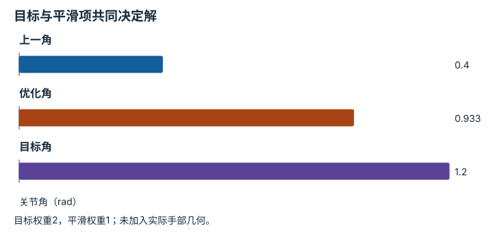
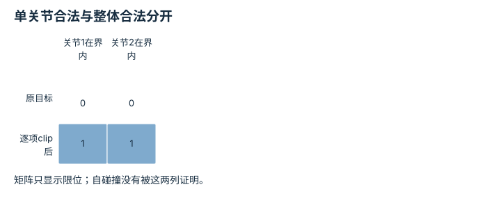
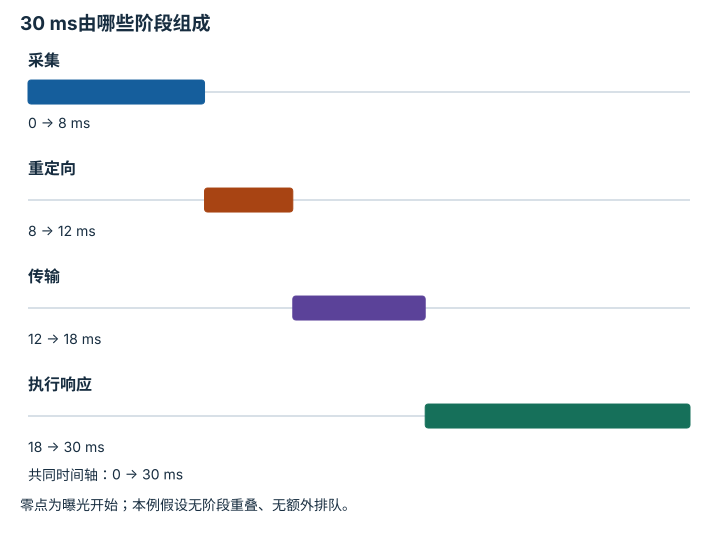

# 灵巧操作、重定向与遥操作：逐点细解

<!-- Generated by scripts/build_knowledge_atlas.py; edit knowledge/atlas/*.json. -->

[全部知识点](../index.md) · [返回原课程](../../pipelines/08-dexterous-retargeting.md)

Dexterity, retargeting, and teleoperation · 本页拆成 **4 个小知识点**。

先阅读直觉和原理，再独立完成算例、自测；图是解释工具，不是已掌握或真机验证的证明。

## 前置知识

[正运动学、Jacobian 与 IK](../robot-kinematics/index.md) → [滤波、融合与状态估计](../system-state-estimation/index.md) → [接触、摩擦与抓取稳定性](../robot-contact-friction/index.md)

## 本页知识点

1. [重定向不是复制人手关节角](#dex-retarget-objective)
2. [可实现性要先于外观相似](#dex-constraint-projection)
3. [滤波降低抖动，同时引入跟随滞后](#dex-filter-lag)
4. [求解器耗时不是端到端延迟](#dex-end-to-end-latency)

## 1. 重定向不是复制人手关节角

**Kinematic retargeting objective**

**需要先懂：**正运动学、优化

### 一句话直觉

人手与机器人手长度、关节数不同，复制角度未必复制抓取关系。

### 原理拆开看

1. 先选择要保持的任务量，例如指尖位置或指间方向，再通过机器人FK计算候选结果。
2. 优化目标比较人手目标与机器人可实现量，约束目标手的关节范围和几何。
3. 正则项可惩罚过大变化，但需说明权重、单位及其与任务误差的权衡。

### 手算或追踪一个例子

1. 教学标量代理：目标关节角1.2 rad，上一角0.4 rad，代价2(q−1.2)²+(q−0.4)²。
2. 求导令4(q−1.2)+2(q−0.4)=0，得q=5.6/6≈0.933 rad。
3. 解没有完全追到1.2，因为平滑正则牺牲部分目标精度；真实手需用FK而非该标量代理。

### 用图理解

<figure class="atlas-visual" tabindex="0" aria-label="目标与平滑项共同决定解；窄屏可在图内横向滚动">
<picture>
<source media="(max-width: 600px)" srcset="../../assets/knowledge-atlas/dex-retarget-objective-mobile.svg">

</picture>
<figcaption>教学标量二次目标，不是实测手部结果。</figcaption>
</figure>

- 中间柱位于两目标之间，位置由权重而不是简单等分决定。
- 图不证明指尖几何匹配；必须回到机器人FK验证。

查看作图数据，自己复算

图上数值可能为便于阅读而取近似值，以下保留作图输入。

| 项目 | 关节角（rad） |
| --- | --- |
| 上一角 | 0.4 |
| 优化角 | 0.9333 |
| 目标角 | 1.2 |

### 容易混淆的地方

**常见误解：**重定向误差非零说明求解器一定坏了。

**为什么不成立：**不同本体和正则权衡可能使零误差不可达或非最优。

**正确理解：**同时报告任务误差、约束残差与平滑项。

### 自测

把正则权重降为0，标量例子输出多少？

展开答案与推理

1.2 rad，前提是仍满足关节约束；真实多关节问题可能存在多个解。

**原始资料：**[Dex Retargeting 作者代码](https://github.com/dexsuite/dex-retargeting)

## 2. 可实现性要先于外观相似

**Joint and self-collision feasibility**

**需要先懂：**关节限位、碰撞

### 一句话直觉

模仿得像但两根机器人手指互相穿过，不是有效控制目标。

### 原理拆开看

1. 候选姿态需逐层检查关节范围、自碰撞、外部碰撞及速度变化。
2. 逐关节截断只能满足简单区间约束，可能破坏指间关系，也不能解决自碰撞。
3. 不可行结果应明确拒绝或重新求解，不应静默标作高质量重定向。

### 手算或追踪一个例子

1. 教学例：目标角为[1.4,−0.2] rad，两关节范围均[0,1] rad。
2. 逐项截断得[1,0]，平方角误差为0.4²+0.2²=0.20 rad²。
3. 即使两角都合法，仍必须运行几何检查；区间内也可能手指相撞。

### 用图理解

<figure class="atlas-visual" tabindex="0" aria-label="单关节合法与整体合法分开；窄屏可在图内横向滚动">
<picture>
<source media="(max-width: 600px)" srcset="../../assets/knowledge-atlas/dex-constraint-projection-mobile.svg">

</picture>
<figcaption>教学候选准入检查。</figcaption>
</figure>

- 第二行全为1仅表示限位通过。
- 图刻意没有自碰撞列，提醒读者证据缺失不能当通过。

查看作图数据，自己复算

图上数值可能为便于阅读而取近似值，以下保留作图输入。

| 行 / 列 | 关节1在界内 | 关节2在界内 |
| --- | --- | --- |
| 原目标 | 0 | 0 |
| 逐项clip后 | 1 | 1 |

### 容易混淆的地方

**常见误解：**clip后所有值都合法，所以整个姿态合法。

**为什么不成立：**独立区间检查忽略了关节之间的几何耦合。

**正确理解：**保留约束检查链和每个拒绝原因。

### 自测

截断后的姿态可以用于学习标签而不作标记吗？

展开答案与推理

不宜；需要记录修正与残差，否则模型可能学习被破坏的动作语义。

**原始资料：**[Dex Retargeting 作者代码](https://github.com/dexsuite/dex-retargeting) · [MIT Manipulation：Motion Planning](https://manipulation.mit.edu/trajectories.html)

## 3. 滤波降低抖动，同时引入跟随滞后

**Smoothing versus lag**

**需要先懂：**加权平均、离散时间

### 一句话直觉

画面更平滑不一定更及时，遥操作要同时看噪声与延迟。

### 原理拆开看

1. 一阶滤波定义y当前=αx当前+(1−α)y前次，0<α≤1，x为输入角度、y为输出。
2. 较小α让单次输入变化影响更小，通常抑制高频抖动但跟随阶跃更慢。
3. 滤波响应滞后与相机、网络、求解耗时是不同来源，应分别记录。

### 手算或追踪一个例子

1. 教学例：初始y=0，输入突然变为1 rad并保持，α=0.2。
2. 第一步y=0.2，第二步0.2+0.8×0.2=0.36，第三步0.488 rad。
3. 三步后仍差0.512 rad；曲线平滑但尚未跟上目标。

### 用图理解

<figure class="atlas-visual" tabindex="0" aria-label="平滑阶跃的跟随代价；窄屏可在图内横向滚动">
<picture>
<source media="(max-width: 600px)" srcset="../../assets/knowledge-atlas/dex-filter-lag-mobile.svg">

</picture>
<figcaption>教学一阶递推，连线仅辅助读离散样本。</figcaption>
</figure>

- 输出逐步靠近目标，不能只比较曲线是否光滑。
- 横轴是更新次数；换成真实时间还需要采样周期。

查看作图数据，自己复算

图上数值可能为便于阅读而取近似值，以下保留作图输入。线段的含义以本图图注和读图说明为准，不应自行解释为实测连续轨迹。

| 曲线 | 更新次数（步） | 角度（rad） |
| --- | --- | --- |
| 原始目标 | 0 | 0 |
| 原始目标 | 1 | 1 |
| 原始目标 | 2 | 1 |
| 原始目标 | 3 | 1 |
| 原始目标 | 4 | 1 |
| α=0.2输出 | 0 | 0 |
| α=0.2输出 | 1 | 0.2 |
| α=0.2输出 | 2 | 0.36 |
| α=0.2输出 | 3 | 0.488 |
| α=0.2输出 | 4 | 0.5904 |

### 容易混淆的地方

**常见误解：**滤波后的抖动小，就证明遥操作体验更好。

**为什么不成立：**平滑可能以更大的任务滞后为代价。

**正确理解：**联合比较噪声、阶跃响应、接触成功与延迟。

### 自测

α=1时会发生什么？

展开答案与推理

输出直接等于当前输入，无该滤波造成的平滑和递推滞后，也不消除其他链路延迟。

**原始资料：**[Dex Retargeting 作者代码](https://github.com/dexsuite/dex-retargeting)

## 4. 求解器耗时不是端到端延迟

**End-to-end teleoperation latency**

**需要先懂：**时间戳、流水线

### 一句话直觉

一次重定向只算4 ms，不代表机器人在4 ms内响应人手。

### 原理拆开看

1. 定义端到端起点和终点，例如相机曝光到机器人执行器收到并响应新命令。
2. 分别测采集、计算、排队、传输与执行阶段；串行链可相加，重叠流水线要用实际时间戳。
3. 平均值不能描述尾部卡顿，还需报告分位数和时钟同步误差。

### 手算或追踪一个例子

1. 教学串行例：采集8 ms、重定向4 ms、传输6 ms、执行响应12 ms。
2. 端到端为8+4+6+12=30 ms；重定向只占4/30≈13.3%。
3. 把4 ms写成总延迟会漏掉26 ms，错误夸大系统及时性。

### 用图理解

<figure class="atlas-visual" tabindex="0" aria-label="30 ms由哪些阶段组成；窄屏可在图内横向滚动">
<picture>
<source media="(max-width: 600px)" srcset="../../assets/knowledge-atlas/dex-end-to-end-latency-mobile.svg">

</picture>
<figcaption>教学串行预算，不是硬件测量。</figcaption>
</figure>

- 最短的求解段不能代表整条时间线。
- 流水线重叠时不能照搬串行相加，应改用真实起止时间戳。

查看作图数据，自己复算

图上数值可能为便于阅读而取近似值，以下保留作图输入。

| 事件 | 开始 (ms) | 结束 (ms) |
| --- | --- | --- |
| 采集 | 0 | 8 |
| 重定向 | 8 | 12 |
| 传输 | 12 | 18 |
| 执行响应 | 18 | 30 |

### 容易混淆的地方

**常见误解：**算法平均4 ms，所以整条遥操作延迟4 ms。

**为什么不成立：**计算只是链路中的一段。

**正确理解：**注明计时边界，单独报告端到端分布。

### 自测

若将重定向耗时减半，串行例总延迟变多少？

展开答案与推理

28 ms，只减少2 ms；其余瓶颈没有改变。

**原始资料：**[ROS REP-103：单位与坐标约定](https://github.com/ros-infrastructure/rep/blob/master/rep-0103.rst)

## 从理解走向证据

本节点原有验收要求：独立验证几何、时序质量、安全准入与任务结果。

完成图解自测后，回到[原课程](../../pipelines/08-dexterous-retargeting.md)运行对应示例并保留证据；浏览页面和查看答案不会自动获得课程晋级。
