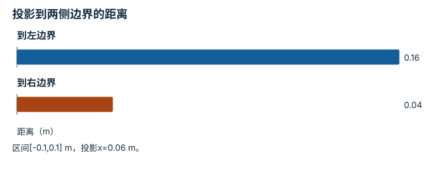
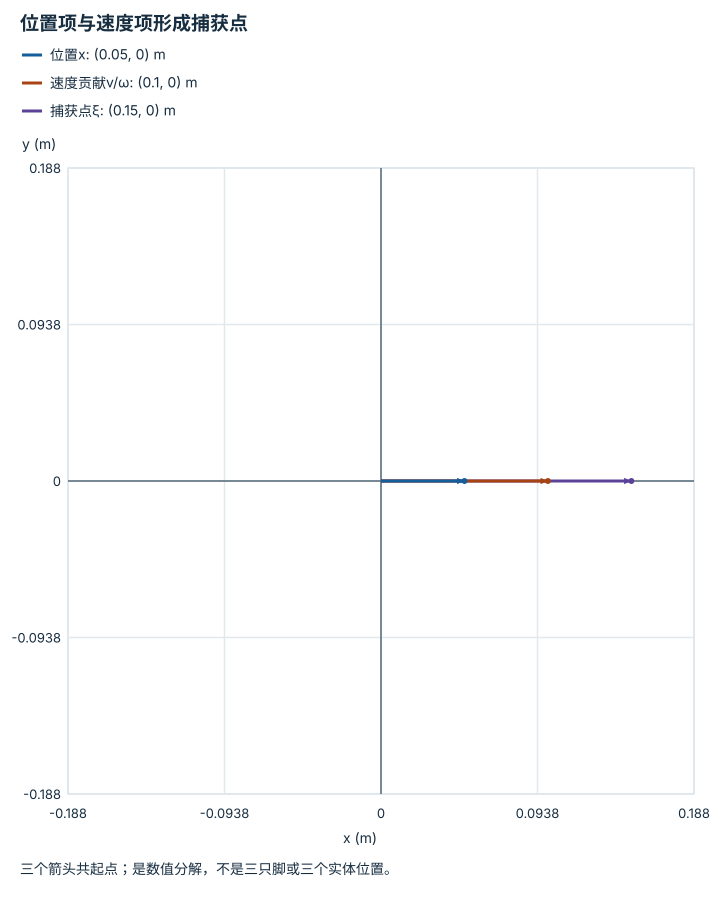
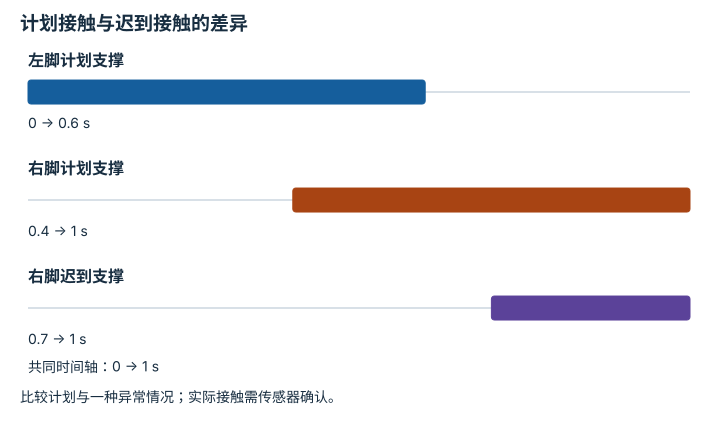
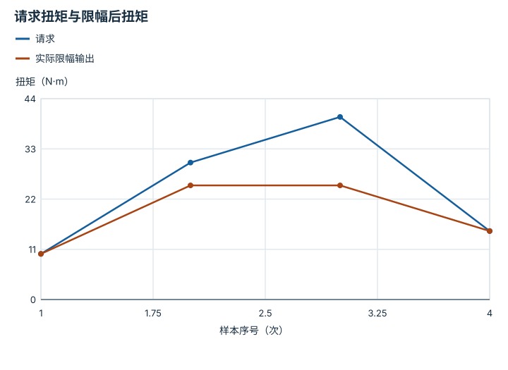

---
search:
  exclude: true
---

# 运动控制、平衡与人形系统：逐点细解

<!-- Generated by scripts/build_knowledge_atlas.py; edit knowledge/atlas/*.json. -->

[按小节学习](../index.md) · [全部知识点](../../index.md) · [返回原课程](../../../pipelines/10-navigation-locomotion.md)

Locomotion, balance, and humanoid systems · 本页拆成 **5 个小知识点**。

先阅读直觉和原理，再独立完成算例、自测；图是解释工具，不是已掌握或真机验证的证明。

## 前置知识

[刚体动力学与积分](../../robot-rigid-body-dynamics/index.md) → [反馈、轨迹与饱和](../../system-feedback-control/index.md) → [强化学习与后训练](../../learning-reinforcement-learning/index.md)

## 本页知识点

1. [静态支撑多边形只回答静态问题](#locomotion-support-polygon)
2. [捕获点把重心速度也纳入平衡判断](#locomotion-capture-point)
3. [足底接触力不能任意指向](#locomotion-friction-cone)
4. [摆动相与支撑相遵守不同约束](#locomotion-contact-schedule)
5. [关节跟踪与电机可实现性是两道门](#locomotion-actuator-limits)

## 1. 静态支撑多边形只回答静态问题

**Static support polygon**

**需要先懂：**重心、力矩

### 一句话直觉

站着不倒与运动中能恢复平衡，是不同条件。

### 原理拆开看

1. 在平地、准静态、仅重力和足底支撑的简化条件下，重心投影需要落在接触支撑多边形内。
2. 投影越靠边，可抵抗的小扰动余量越小；这里没有考虑运动速度。
3. 动态行走需要进一步考虑惯性、接触力矩、角动量和可迈步区域，不能只检查静态投影。

### 手算或追踪一个例子

1. 教学一维支撑区间[-0.1,0.1] m，重心投影x=0.06 m。
2. 离左右边界分别0.16与0.04 m，最小静态几何余量0.04 m。
3. 若x变为0.12 m，投影超出右界0.02 m；题设静态支撑条件不满足。

### 用图理解

<figure class="atlas-visual" tabindex="0" aria-label="投影到两侧边界的距离；窄屏可在图内横向滚动">
<picture>
<source media="(max-width: 600px)" srcset="../../../assets/knowledge-atlas/locomotion-support-polygon-mobile.svg">

</picture>
<figcaption>教学静态几何余量。</figcaption>
</figure>

- 较短柱为当前最小几何余量，不是平衡概率。
- 图没有速度或角动量，因此不提供动态恢复保证。

查看作图数据，自己复算

图上数值可能为便于阅读而取近似值，以下保留作图输入。

| 项目 | 距离（m） |
| --- | --- |
| 到左边界 | 0.16 |
| 到右边界 | 0.04 |

### 容易混淆的地方

**常见误解：**重心投影在脚内就保证跑动不摔。

**为什么不成立：**动态速度与角动量不在该静态条件中。

**正确理解：**明确静态假设，再为动态任务检查更多状态。

### 自测

在x=0.06 m时有很大的向右速度，还能凭0.04 m余量宣布稳定吗？

展开答案与推理

不能；速度可能让系统越过可恢复区域，应检查动态模型和落脚能力。

**原始资料：**[MIT Underactuated：Highly-articulated Legged Robots](https://underactuated.mit.edu/humanoids.html)

## 2. 捕获点把重心速度也纳入平衡判断

**Capture point in the LIP model**

**需要先懂：**重心速度、倒立摆

### 一句话直觉

同样站在脚中心，身体向前冲得越快，可能越需要把脚迈向前方。

### 原理拆开看

1. 线性倒立摆LIP假设重心高度h恒定且忽略角动量变化，定义ω=√(g/h)。
2. 一维捕获点ξ=x+v/ω，将当前水平位置x与速度v结合；v/ω单位为米。
3. 捕获点是否可由支撑或下一落脚位置覆盖，可用于这个模型中的恢复分析，不是完整人体或机器人稳定判据。

### 手算或追踪一个例子

1. 教学例：g=9.81 m/s²，h=1.09 m，所以ω=3 s⁻¹；x=0.05 m，v=0.3 m/s。
2. ξ=0.05+0.3/3=0.15 m，而当前支撑右界0.1 m。
3. 虽然x仍在脚内，捕获点已在脚外0.05 m，提示仅靠当前支撑可能不足以捕获该运动。

### 用图理解

<figure class="atlas-visual" tabindex="0" aria-label="位置项与速度项形成捕获点；窄屏可在图内横向滚动">
<picture>
<source media="(max-width: 600px)" srcset="../../../assets/knowledge-atlas/locomotion-capture-point-mobile.svg">

</picture>
<figcaption>教学同原点向量，第三箭头为前两项之和。</figcaption>
</figure>

- 第三箭头更长，说明速度让所需恢复位置越过当前静态投影。
- 图没有落脚约束或接触力限制，不能当完整步态规划器。

查看作图数据，自己复算

图上数值可能为便于阅读而取近似值，以下保留作图输入。

| 向量 | x (m) | y (m) |
| --- | --- | --- |
| 位置x | 0.05 | 0 |
| 速度贡献v/ω | 0.1 | 0 |
| 捕获点ξ | 0.15 | 0 |

### 容易混淆的地方

**常见误解：**位置相同，平衡难度就相同。

**为什么不成立：**速度改变动量与后续运动。

**正确理解：**同时看位置、速度及模型允许的支撑控制。

### 自测

若v=−0.3 m/s，捕获点是多少？

展开答案与推理

−0.05 m；速度方向改变把捕获点移向另一侧，结果仍依赖LIP假设。

**原始资料：**[MIT Underactuated：Highly-articulated Legged Robots](https://underactuated.mit.edu/humanoids.html)

## 3. 足底接触力不能任意指向

**Friction cone**

**需要先懂：**摩擦、合力

### 一句话直觉

想要更大的水平加速度，地面未必能提供足够摩擦。

### 原理拆开看

1. 简化库仑摩擦模型中，法向力Fn≥0，切向力大小Ft需满足Ft≤μFn。
2. 超过边界意味着静摩擦不足，规划的无滑动接触假设失效。
3. μ依赖材料和状态；控制还要考虑力分配、接触面积和力矩限制。

### 手算或追踪一个例子

1. 教学例：μ=0.5，Fn=100 N，最大允许切向力50 N。
2. 候选Ft=40 N的比值0.4低于μ；候选Ft=60 N比值0.6高于μ。
3. 第二个候选不满足题设无滑动约束，即使电机有能力施加该力。

### 用图理解

<figure class="atlas-visual" tabindex="0" aria-label="接触力的无滑动边界；窄屏可在图内横向滚动">
<picture>
<source media="(max-width: 600px)" srcset="../../../assets/knowledge-atlas/locomotion-friction-cone-mobile.svg">

</picture>
<figcaption>教学二维力截面，线下满足Ft≤0.5Fn。</figcaption>
</figure>

- 同一Fn=100处，40在边界下，60在边界上方。
- 候选两点间连线只是标记，不表示连续可执行受力过程。

查看作图数据，自己复算

图上数值可能为便于阅读而取近似值，以下保留作图输入。线段的含义以本图图注和读图说明为准，不应自行解释为实测连续轨迹。

| 曲线 | 法向力Fn（N） | 切向力Ft（N） |
| --- | --- | --- |
| 摩擦边界 | 0 | 0 |
| 摩擦边界 | 100 | 50 |
| 摩擦边界 | 200 | 100 |
| 候选接触力 | 100 | 40 |
| 候选接触力 | 100 | 60 |

### 容易混淆的地方

**常见误解：**电机扭矩够大就一定能按规划加速。

**为什么不成立：**地面接触可能先打滑，执行器能力不是唯一边界。

**正确理解：**联合检查执行器与接触约束。

### 自测

Fn降低到60 N时，Ft=40 N仍可保持题设静摩擦吗？

展开答案与推理

不满足，因为μFn=30 N；同样水平力在更小法向载荷下更容易失去静摩擦。

**原始资料：**[MIT Underactuated：Planning and Control through Contact](https://underactuated.mit.edu/contact.html) · [MIT Underactuated：Highly-articulated Legged Robots](https://underactuated.mit.edu/humanoids.html)

## 4. 摆动相与支撑相遵守不同约束

**Hybrid contact phases**

**需要先懂：**状态机、接触

### 一句话直觉

脚在空中和脚踩地时，能施加的力与运动规律不同。

### 原理拆开看

1. 接触计划指定每只脚何时支撑、何时摆动；支撑脚需满足接触约束，摆动脚不能承担地面支撑力。
2. 落地瞬间可能有冲击，状态和速度关系不能按一套平滑方程无缝忽略。
3. 阶段切换需由计划与实际接触检测共同判断，提前或延后接触会改变动力学。

### 手算或追踪一个例子

1. 教学周期1 s：左脚0–0.6 s支撑，右脚0.4–1 s支撑。
2. 0.4–0.6 s两脚都支撑，重叠0.2 s；0–0.4 s只有左脚支撑。
3. 若右脚实际0.7 s才接触，而左脚仍0.6 s离地，会出现0.1 s无支撑间隙。

### 用图理解

<figure class="atlas-visual" tabindex="0" aria-label="计划接触与迟到接触的差异；窄屏可在图内横向滚动">
<picture>
<source media="(max-width: 600px)" srcset="../../../assets/knowledge-atlas/locomotion-contact-schedule-mobile.svg">

</picture>
<figcaption>教学接触时序，不是步态推荐。</figcaption>
</figure>

- 右脚迟到线与左脚线之间的空隙，是0.1 s潜在无支撑期。
- 图不含冲击力或身体姿态，不能证明该异常一定或不会摔倒。

查看作图数据，自己复算

图上数值可能为便于阅读而取近似值，以下保留作图输入。

| 事件 | 开始 (s) | 结束 (s) |
| --- | --- | --- |
| 左脚计划支撑 | 0 | 0.6 |
| 右脚计划支撑 | 0.4 | 1 |
| 右脚迟到支撑 | 0.7 | 1 |

### 容易混淆的地方

**常见误解：**只要两条腿各完成动作，支撑自然连续。

**为什么不成立：**接触时序错配可能造成意外腾空或冲击。

**正确理解：**监测真实接触，并明确异常切换的处理策略。

### 自测

计划中的双支撑区间是否证明实际两脚都承重？

展开答案与推理

不能；还需接触和受力证据，脚贴地不一定有显著支撑力。

**原始资料：**[MIT Underactuated：Planning and Control through Contact](https://underactuated.mit.edu/contact.html)

## 5. 关节跟踪与电机可实现性是两道门

**Actuator saturation and tracking**

**需要先懂：**扭矩、限幅

### 一句话直觉

仿真动作曲线跟得漂亮，可能只是因为用了真实电机做不到的扭矩。

### 原理拆开看

1. 控制器根据状态误差请求扭矩，执行器实际输出受幅值、速度、温度和供电约束。
2. 限幅使真实输入不同于控制设计假设，误差可能继续增大；积分项还可能积累。
3. 评价步态要同时报告跟踪误差、饱和时长、接触和跌倒，不只看关节曲线。

### 手算或追踪一个例子

1. 教学例：请求扭矩[10,30,40,15] N·m，简化上限25 N·m，各样本等时长。
2. 实际输出[10,25,25,15]，第2和第3样本限幅，比例2/4=50%。
3. 跟踪变差可能来自执行边界，不应先断言策略缺少训练数据。

### 用图理解

<figure class="atlas-visual" tabindex="0" aria-label="请求扭矩与限幅后扭矩；窄屏可在图内横向滚动">
<picture>
<source media="(max-width: 600px)" srcset="../../../assets/knowledge-atlas/locomotion-actuator-limits-mobile.svg">

</picture>
<figcaption>教学等时长离散样本，连线仅示意。</figcaption>
</figure>

- 两条线分离的样本说明控制器假设输入与实际输入不同。
- 这不是电机实测；真实速度相关扭矩包络需查具体设备。

查看作图数据，自己复算

图上数值可能为便于阅读而取近似值，以下保留作图输入。线段的含义以本图图注和读图说明为准，不应自行解释为实测连续轨迹。

| 曲线 | 样本序号（次） | 扭矩（N·m） |
| --- | --- | --- |
| 请求 | 1 | 10 |
| 请求 | 2 | 30 |
| 请求 | 3 | 40 |
| 请求 | 4 | 15 |
| 实际限幅输出 | 1 | 10 |
| 实际限幅输出 | 2 | 25 |
| 实际限幅输出 | 3 | 25 |
| 实际限幅输出 | 4 | 15 |

### 容易混淆的地方

**常见误解：**控制器算出的扭矩就是电机实际施加的扭矩。

**为什么不成立：**执行器可能限幅或受速率、温度限制。

**正确理解：**分别记录请求、准入和实测输出。

### 自测

50%采样限幅是否一定等于50%时间限幅？

展开答案与推理

只有采样或积分区间等时长时才相等；不等时需按持续时间加权。

**原始资料：**[Sim-to-Real：Learning Agile Locomotion 原论文](https://arxiv.org/abs/1804.10332) · [MIT Underactuated：Highly-articulated Legged Robots](https://underactuated.mit.edu/humanoids.html)

## 从理解走向证据

本节点原有验收要求：提高物理风险前先通过纯运动仿真与安全回归。

完成图解自测后，回到[原课程](../../../pipelines/10-navigation-locomotion.md)运行对应示例并保留证据；浏览页面和查看答案不会自动获得课程晋级。
