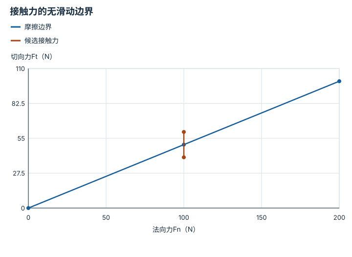

---
hide:
  - navigation
---

<!-- Generated by scripts/build_knowledge_atlas.py; edit knowledge/atlas/*.json. -->

<nav class="study-breadcrumb" aria-label="学习位置" markdown="1">
[知识目录](../../index.md) / [运动控制、平衡与人形系统](../index.md)
</nav>

L4 · 本章第 3 / 5 节

# 足底接触力不能任意指向

**Friction cone**

想要更大的水平加速度，地面未必能提供足够摩擦。

先确认：这些前置知识我懂了吗？

摩擦、合力

[刚体动力学与积分](../../robot-rigid-body-dynamics/index.md) · [反馈、轨迹与饱和](../../system-feedback-control/index.md) · [强化学习与后训练](../../learning-reinforcement-learning/index.md)

<section class="study-section " markdown="1">

## 1 · 原理拆开看

1. 简化库仑摩擦模型中，法向力Fn≥0，切向力大小Ft需满足Ft≤μFn。
2. 超过边界意味着静摩擦不足，规划的无滑动接触假设失效。
3. μ依赖材料和状态；控制还要考虑力分配、接触面积和力矩限制。

</section>

<section class="study-section " markdown="1">

## 2 · 跟着例子算一遍

1. 教学例：μ=0.5，Fn=100 N，最大允许切向力50 N。
2. 候选Ft=40 N的比值0.4低于μ；候选Ft=60 N比值0.6高于μ。
3. 第二个候选不满足题设无滑动约束，即使电机有能力施加该力。

</section>

<section class="study-section " markdown="1">

## 3 · 对照图，解释变化

<figure class="atlas-visual" tabindex="0" aria-label="接触力的无滑动边界；窄屏可在图内横向滚动">
<picture>
<source media="(max-width: 600px)" srcset="../../../assets/knowledge-atlas/locomotion-friction-cone-mobile.svg">

</picture>
<figcaption>教学二维力截面，线下满足Ft≤0.5Fn。</figcaption>
</figure>

- 同一Fn=100处，40在边界下，60在边界上方。
- 候选两点间连线只是标记，不表示连续可执行受力过程。

查看作图数据，自己复算

图上数值可能为便于阅读而取近似值，以下保留作图输入。线段的含义以本图图注和读图说明为准，不应自行解释为实测连续轨迹。

| 曲线 | 法向力Fn（N） | 切向力Ft（N） |
| --- | --- | --- |
| 摩擦边界 | 0 | 0 |
| 摩擦边界 | 100 | 50 |
| 摩擦边界 | 200 | 100 |
| 候选接触力 | 100 | 40 |
| 候选接触力 | 100 | 60 |

</section>

<section class="study-section study-misconception" markdown="1">

## 4 · 避开一个误区

**容易误以为：**电机扭矩够大就一定能按规划加速。

**为什么不成立：**地面接触可能先打滑，执行器能力不是唯一边界。

**正确理解：**联合检查执行器与接触约束。

</section>

<section class="study-section study-check" markdown="1">

## 5 · 先独立回答

Fn降低到60 N时，Ft=40 N仍可保持题设静摩擦吗？

我已作答，查看推理

不满足，因为μFn=30 N；同样水平力在更小法向载荷下更容易失去静摩擦。

</section>

继续查阅原始资料

- [MIT Underactuated：Planning and Control through Contact](https://underactuated.mit.edu/contact.html)
- [MIT Underactuated：Highly-articulated Legged Robots](https://underactuated.mit.edu/humanoids.html)

<nav class="study-pagination" aria-label="相邻小节" markdown="1">

[← 捕获点把重心速度也纳入平衡判断](../locomotion-capture-point/index.md)

[摆动相与支撑相遵守不同约束 →](../locomotion-contact-schedule/index.md)

</nav>

[返回本章目录](../index.md) · [整章连续阅读](../complete/index.md)

本章最后需要提交什么？

提高物理风险前先通过纯运动仿真与安全回归。

回到[原课程](../../../pipelines/10-navigation-locomotion.md)完成实践。阅读位置或查看答案不计为通过验收。

