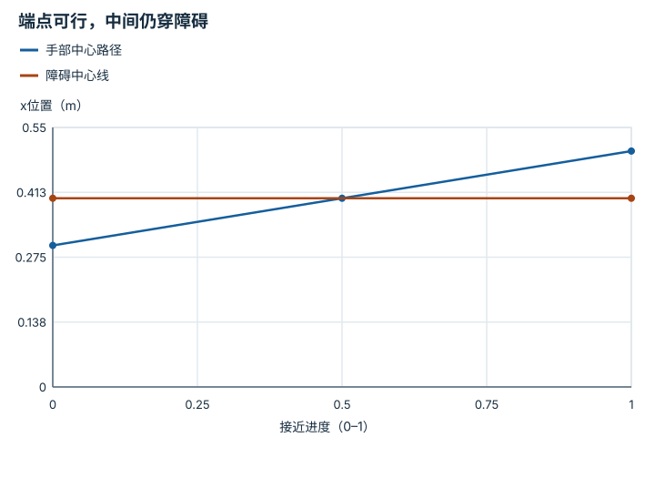
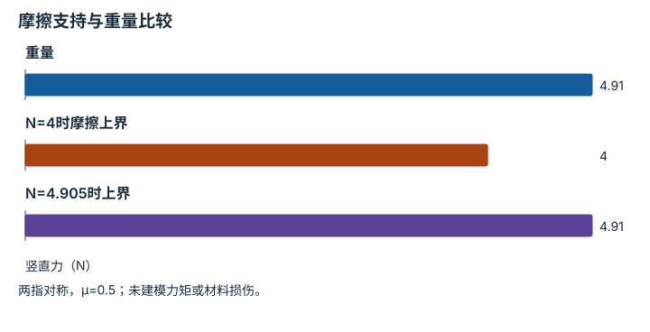
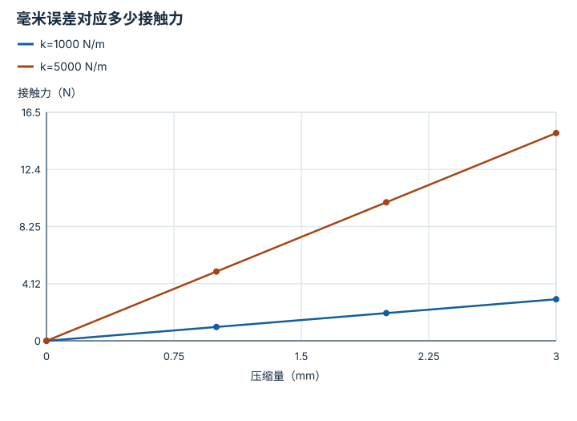
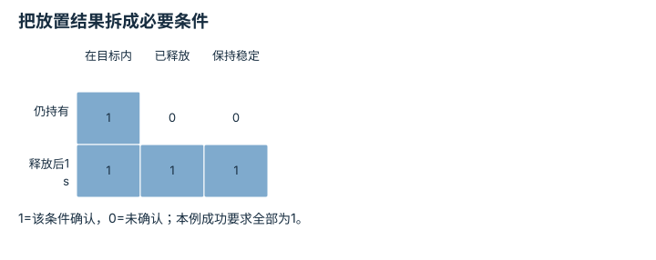

---
search:
  exclude: true
---

# 操作与模仿学习系统：逐点细解

<!-- Generated by scripts/build_knowledge_atlas.py; edit knowledge/atlas/*.json. -->

[按小节学习](../index.md) · [全部知识点](../../index.md) · [返回原课程](../../../pipelines/11-dexterous-manipulation.md)

Manipulation and imitation-learning systems · 本页拆成 **4 个小知识点**。

先阅读直觉和原理，再独立完成算例、自测；图是解释工具，不是已掌握或真机验证的证明。

## 前置知识

[行为克隆与协变量偏移](../../learning-behavior-cloning/index.md) → [运动规划与轨迹优化](../../planning-motion-trajectory/index.md) → [反馈、轨迹与饱和](../../system-feedback-control/index.md)

## 本页知识点

1. [抓取位姿与接近路径必须一起设计](#manipulation-pregrasp)
2. [夹持是否防滑取决于摩擦与负载](#manipulation-friction-grasp)
3. [接触时位置误差会通过刚度变成力](#manipulation-compliance)
4. [放到目标附近与完成放置不同](#manipulation-release-verification)

## 1. 抓取位姿与接近路径必须一起设计

**Pre-grasp approach**

**需要先懂：**位姿、碰撞

### 一句话直觉

手指在最终位置放得下，不代表能从当前位置安全伸进去。

### 原理拆开看

1. 先定义抓取位姿和接近方向，在接触前保留预抓取位置。
2. 检查从预抓取到接触位置的扫掠体，而不只检查两个端点。
3. 接近过程中若场景、目标或状态估计改变，应重新检查，不能把旧路径当永远有效。

### 手算或追踪一个例子

1. 教学例：沿x接近，预抓取x=0.3 m，抓取x=0.5 m；障碍占据x区间[0.39,0.41] m。
2. 两端点均不在障碍区间，但连续直线路径必然经过0.4 m。
3. 因此该接近路径碰撞；需要改接近方向或改变场景，而不是只调整最终手指位置。

### 用图理解

<figure class="atlas-visual" tabindex="0" aria-label="端点可行，中间仍穿障碍；窄屏可在图内横向滚动">
<picture>
<source media="(max-width: 600px)" srcset="../../../assets/knowledge-atlas/manipulation-pregrasp-mobile.svg">

</picture>
<figcaption>教学一维接近路径，障碍中心线用第二条线标出。</figcaption>
</figure>

- 两线相交指出路径经过障碍中心；实际障碍还有0.02 m厚度。
- 图只用点状手部演示，完整手指体积可能让碰撞更早发生。

查看作图数据，自己复算

图上数值可能为便于阅读而取近似值，以下保留作图输入。线段的含义以本图图注和读图说明为准，不应自行解释为实测连续轨迹。

| 曲线 | 接近进度（0–1） | x位置（m） |
| --- | --- | --- |
| 手部中心路径 | 0 | 0.3 |
| 手部中心路径 | 0.5 | 0.4 |
| 手部中心路径 | 1 | 0.5 |
| 障碍中心线 | 0 | 0.4 |
| 障碍中心线 | 1 | 0.4 |

### 容易混淆的地方

**常见误解：**最终抓取姿态无碰撞，接近自然可行。

**为什么不成立：**端点没有描述中间扫掠空间。

**正确理解：**对预抓取、接近、闭合及撤离分别验证。

### 自测

把接近速度减半能消除这个静态碰撞吗？

展开答案与推理

不能；速度改变时间，不改变这条路径穿过障碍的几何事实。

**原始资料：**[MIT Manipulation：Bin Picking](https://manipulation.mit.edu/clutter.html) · [MIT Manipulation：Motion Planning](https://manipulation.mit.edu/trajectories.html)

## 2. 夹持是否防滑取决于摩擦与负载

**Frictional grasp support**

**需要先懂：**力平衡、摩擦系数

### 一句话直觉

夹爪合上不等于物体受到足以抗重力的摩擦力。

### 原理拆开看

1. 教学两侧平行指模型：每指法向力N，摩擦系数μ，两指最大竖直静摩擦合计2μN。
2. 静止悬持质量m物体至少需要2μN不小于mg；这只是无其他外力的理想必要条件。
3. 实际还需考虑力矩、接触几何、表面变化与损伤限制，不能直接把算出的力当硬件设定值。

### 手算或追踪一个例子

1. 教学例：m=0.5 kg，g=9.81 m/s²，μ=0.5，两侧法向力相同。
2. 重量为4.905 N；每指N=4 N时，总摩擦上界2×0.5×4=4 N，不足。
3. 理想临界值N=4.905 N/指；等号无裕量，不代表可安全抓持。

### 用图理解

<figure class="atlas-visual" tabindex="0" aria-label="摩擦支持与重量比较；窄屏可在图内横向滚动">
<picture>
<source media="(max-width: 600px)" srcset="../../../assets/knowledge-atlas/manipulation-friction-grasp-mobile.svg">

</picture>
<figcaption>教学静力平衡，不是夹爪推荐力。</figcaption>
</figure>

- 第二柱低于重量，说明这个理想模型无法静止悬持。
- 达到等高只是临界必要条件，不构成现实抓取稳定保证。

查看作图数据，自己复算

图上数值可能为便于阅读而取近似值，以下保留作图输入。

| 项目 | 竖直力（N） |
| --- | --- |
| 重量 | 4.905 |
| N=4时摩擦上界 | 4 |
| N=4.905时上界 | 4.905 |

### 容易混淆的地方

**常见误解：**只要夹持位置准确就不会掉。

**为什么不成立：**位置精度没有直接给出接触力与摩擦裕量。

**正确理解：**同时验证几何、力与物体结果，遵守硬件额定条件。

### 自测

μ降为0.25，理想临界N是多少？

展开答案与推理

每指9.81 N；摩擦减半需法向力翻倍，但这可能超出物体或执行器限制。

**原始资料：**[MIT Manipulation：Bin Picking](https://manipulation.mit.edu/clutter.html) · [MIT Underactuated：Planning and Control through Contact](https://underactuated.mit.edu/contact.html)

## 3. 接触时位置误差会通过刚度变成力

**Compliance and impedance**

**需要先懂：**弹簧、力

### 一句话直觉

自由空间里几毫米位置误差不起眼，碰到硬表面后却可能变成明显接触力。

### 原理拆开看

1. 用一维等效弹簧解释顺应性：F=kδ，k单位N/m，δ为接触压缩量m。
2. 同样压缩下更大刚度产生更大力；顺应控制用位置、速度与力关系塑造响应。
3. 真实接触还有阻尼、摩擦、控制延迟和离散稳定性，不能把静态弹簧等式当完整控制器。

### 手算或追踪一个例子

1. 教学例：刚度k=1000 N/m，表面位置误差导致压缩δ=0.003 m。
2. 接触力为1000×0.003=3 N；若刚度提高到5000 N/m，则为15 N。
3. 位置误差相同，接触力放大5倍，说明接触任务不能只优化位置跟踪误差。

### 用图理解

<figure class="atlas-visual" tabindex="0" aria-label="毫米误差对应多少接触力；窄屏可在图内横向滚动">
<picture>
<source media="(max-width: 600px)" srcset="../../../assets/knowledge-atlas/manipulation-compliance-mobile.svg">

</picture>
<figcaption>教学线性弹簧关系。</figcaption>
</figure>

- 直线斜率表示刚度；横轴mm换成m后才可代入F=kδ。
- 图未包含动态冲击，不能用于认证真实接触峰值力。

查看作图数据，自己复算

图上数值可能为便于阅读而取近似值，以下保留作图输入。线段的含义以本图图注和读图说明为准，不应自行解释为实测连续轨迹。

| 曲线 | 压缩量（mm） | 接触力（N） |
| --- | --- | --- |
| k=1000 N/m | 0 | 0 |
| k=1000 N/m | 1 | 1 |
| k=1000 N/m | 2 | 2 |
| k=1000 N/m | 3 | 3 |
| k=5000 N/m | 0 | 0 |
| k=5000 N/m | 1 | 5 |
| k=5000 N/m | 2 | 10 |
| k=5000 N/m | 3 | 15 |

### 容易混淆的地方

**常见误解：**刚度越高，操作一定越精确也越安全。

**为什么不成立：**高刚度会把建模和定位误差转换成更大力。

**正确理解：**根据任务与硬件限制联合检查跟踪、顺应性和接触结果。

### 自测

降低刚度是否总能避免损伤？

展开答案与推理

不能；也可能导致支撑不足、振荡或掉落，需要完整接触与控制验证。

**原始资料：**[MIT Underactuated：Planning and Control through Contact](https://underactuated.mit.edu/contact.html)

## 4. 放到目标附近与完成放置不同

**Placement and release verification**

**需要先懂：**任务谓词、持续检测

### 一句话直觉

手移动到盒子上方但仍夹着物体，不叫完成放置。

### 原理拆开看

1. 把成功拆为物体在目标区域、支撑成立、机器人已释放以及保持稳定等必要条件。
2. 分别使用物体位姿、接触或夹爪状态验证，避免把手的目标到达当物体成功。
3. 释放后继续观察一段明示时间，排除滑落或弹出；监控时长取决于任务协议。

### 手算或追踪一个例子

1. 教学例：目标x区间[0.4,0.6] m，物体在x=0.5，但夹爪仍持有。
2. 区域条件为1，释放条件为0；两者逻辑与为0，不能宣布成功。
3. 释放后物体停在0.52 m且按协议保持1 s，才满足本例的放置检查。

### 用图理解

<figure class="atlas-visual" tabindex="0" aria-label="把放置结果拆成必要条件；窄屏可在图内横向滚动">
<picture>
<source media="(max-width: 600px)" srcset="../../../assets/knowledge-atlas/manipulation-release-verification-mobile.svg">

</picture>
<figcaption>教学两个观测时刻。</figcaption>
</figure>

- 第一行不能被第一列的1掩盖，释放也是独立门。
- 图中的条件未包含所有可能任务要求，例如物体朝向。

查看作图数据，自己复算

图上数值可能为便于阅读而取近似值，以下保留作图输入。

| 行 / 列 | 在目标内 | 已释放 | 保持稳定 |
| --- | --- | --- | --- |
| 仍持有 | 1 | 0 | 0 |
| 释放后1 s | 1 | 1 | 1 |

### 容易混淆的地方

**常见误解：**末端到达目标位姿就等于物体放好了。

**为什么不成立：**物体可能仍被夹住，或释放后滑走。

**正确理解：**验证物体最终状态及释放后的持续条件。

### 自测

目标区域内但物体倒置，算成功吗？

展开答案与推理

取决于事先定义的姿态条件；不能看结果后临时放宽任务定义。

**原始资料：**[MIT Manipulation：Bin Picking](https://manipulation.mit.edu/clutter.html)

## 从理解走向证据

本节点原有验收要求：报告任务成功率与按阶段拆解的失败分类。

完成图解自测后，回到[原课程](../../../pipelines/11-dexterous-manipulation.md)运行对应示例并保留证据；浏览页面和查看答案不会自动获得课程晋级。
