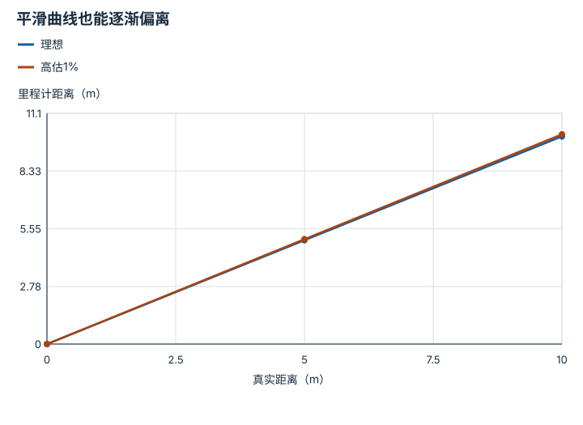
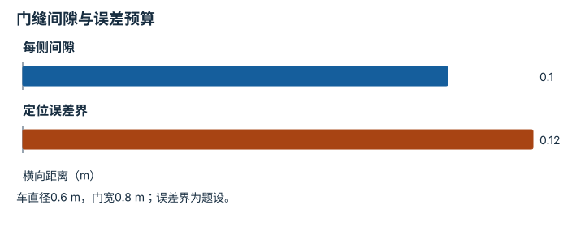
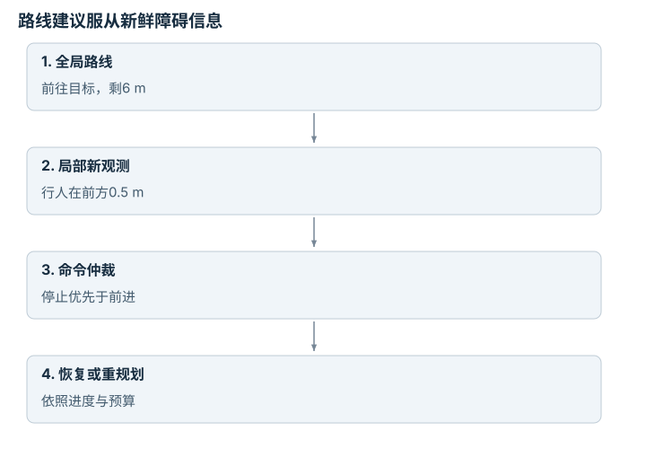
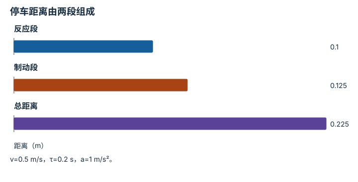

---
search:
  exclude: true
---

# 导航与移动具身智能体：逐点细解

<!-- Generated by scripts/build_knowledge_atlas.py; edit knowledge/atlas/*.json. -->

[按小节学习](../index.md) · [全部知识点](../../index.md) · [返回原课程](../../../pipelines/10-navigation-locomotion.md)

Navigation and mobile embodied agents · 本页拆成 **5 个小知识点**。

先阅读直觉和原理，再独立完成算例、自测；图是解释工具，不是已掌握或真机验证的证明。

## 前置知识

[滤波、融合与状态估计](../../system-state-estimation/index.md) → [运动规划与轨迹优化](../../planning-motion-trajectory/index.md) → [具身推理、监控与恢复](../../planning-reasoning-recovery/index.md)

## 本页知识点

1. [未知栅格不是空闲栅格](#navigation-occupancy-unknown)
2. [里程计连续不等于全局位置准确](#navigation-odometry-drift)
3. [膨胀半径要反映车体和定位误差](#navigation-footprint-inflation)
4. [全局路线与局部避障分别处理不同尺度](#navigation-global-local)
5. [反应延迟会直接增加停车距离](#navigation-stopping-distance)

## 1. 未知栅格不是空闲栅格

**Occupancy and unknown space**

**需要先懂：**概率、网格地图

### 一句话直觉

传感器没看见墙，不等于已证明那里没有墙。

### 原理拆开看

1. 占据地图为网格保存占据估计或未知状态；未知表示缺少足够观测。
2. 规划器必须明确是否允许进入未知区域，不同任务的探索和保守策略不同。
3. 地图分辨率与传感器遮挡会改变可通行判断，不能把离散地图当连续世界真值。

### 手算或追踪一个例子

1. 教学3×3地图用0表示空闲、1表示障碍、−1表示未知，中央格为1，右列未知。
2. 起点在左下；沿上方到右上会进入未知格，而不是一条已确认无障碍路线。
3. 若协议不允许未知，则该路线暂不可采用；需重新观测或选择已知区域。

### 用图理解

<figure class="atlas-visual" tabindex="0" aria-label="三种地图状态不要混合；窄屏可在图内横向滚动">
<picture>
<source media="(max-width: 600px)" srcset="../../../assets/knowledge-atlas/navigation-occupancy-unknown-mobile.svg">

</picture>
<figcaption>教学栅格图，非真实导航地图。</figcaption>
</figure>

- 右列负值只表示未知，不表示更安全或更低碰撞概率。
- 一个格子的状态不能表达窄障碍细节，分辨率仍是限制。

查看作图数据，自己复算

图上数值可能为便于阅读而取近似值，以下保留作图输入。

| 行 / 列 | 左 | 中 | 右 |
| --- | --- | --- | --- |
| 上 | 0 | 0 | -1 |
| 中 | 0 | 1 | -1 |
| 下 | 0 | 0 | -1 |

### 容易混淆的地方

**常见误解：**未知区域没画障碍，可以当空地。

**为什么不成立：**没有数据和确认空闲是不同知识状态。

**正确理解：**保留未知编码并写清规划策略。

### 自测

把未知直接填0会损失什么信息？

展开答案与推理

会把未观测伪装成已确认空闲，之后无法辨别规划依赖了哪些假设。

**原始资料：**[Nav2：Inflation Layer Parameters](https://docs.nav2.org/jazzy/configuration_and_development/configuration_guide/core_servers/costmap_2d/costmap_plugins/inflation/)

## 2. 里程计连续不等于全局位置准确

**Odometry drift and localization**

**需要先懂：**累计误差、坐标系

### 一句话直觉

局部看起来每一步都很顺，走远后却可能整体偏离地图。

### 原理拆开看

1. 里程计通过轮速或短程视觉增量累计位姿，短期连续但误差可累积。
2. 全局定位利用地图或外部观测修正长期漂移，可能引入估计跳变。
3. 控制与规划需处理局部连续坐标和全局修正的关系，不能把坐标重置当物理瞬移。

### 手算或追踪一个例子

1. 教学例：每走1 m，轮式里程计把距离高估1%，真实走10 m。
2. 累计估计距离为10×1.01=10.1 m，误差0.1 m。
3. 地图观测修正到10 m意味着估计变化，不是机器人倒退了0.1 m。

### 用图理解

<figure class="atlas-visual" tabindex="0" aria-label="平滑曲线也能逐渐偏离；窄屏可在图内横向滚动">
<picture>
<source media="(max-width: 600px)" srcset="../../../assets/knowledge-atlas/navigation-odometry-drift-mobile.svg">

</picture>
<figcaption>教学固定比例里程计误差。</figcaption>
</figure>

- 两条线都平滑，终点差才揭示累计偏差。
- 实际误差还受打滑、转弯和地面变化影响，不一定固定比例。

查看作图数据，自己复算

图上数值可能为便于阅读而取近似值，以下保留作图输入。线段的含义以本图图注和读图说明为准，不应自行解释为实测连续轨迹。

| 曲线 | 真实距离（m） | 里程计距离（m） |
| --- | --- | --- |
| 理想 | 0 | 0 |
| 理想 | 5 | 5 |
| 理想 | 10 | 10 |
| 高估1% | 0 | 0 |
| 高估1% | 5 | 5.05 |
| 高估1% | 10 | 10.1 |

### 容易混淆的地方

**常见误解：**定位曲线没有跳变，就说明绝对位置精确。

**为什么不成立：**平滑累计也可能持续偏离真实轨迹。

**正确理解：**同时检查短期连续性与外部参照误差。

### 自测

加大规划频率能消除这种系统性里程计偏差吗？

展开答案与推理

不能直接消除；需要标定、建模或独立观测修正。

**原始资料：**[ROS REP-103：单位与坐标约定](https://github.com/ros-infrastructure/rep/blob/master/rep-0103.rst) · [Sim-to-Real：Learning Agile Locomotion 原论文](https://arxiv.org/abs/1804.10332)

## 3. 膨胀半径要反映车体和定位误差

**Footprint and clearance**

**需要先懂：**机器人尺寸、误差界

### 一句话直觉

中心线路径能通过的门，机器人本体可能进不去。

### 原理拆开看

1. 先用机器人footprint而非单个中心点检查障碍，非圆车体还需考虑朝向。
2. 在明确的误差模型下加入定位或几何余量，区分保守硬边界与用于偏好的软代价。
3. Nav2膨胀层还提供随距离衰减的代价；代价参数不是自动生成的安全认证。

### 手算或追踪一个例子

1. 教学圆车：半径0.3 m，门宽0.8 m，居中时每侧几何间隙(0.8−0.6)/2=0.1 m。
2. 若题设横向定位误差上界0.12 m，最坏一侧会多占0.12 m。
3. 0.1<0.12，不能按该误差界保证通过；减速本身不会改变静态尺寸误差。

### 用图理解

<figure class="atlas-visual" tabindex="0" aria-label="门缝间隙与误差预算；窄屏可在图内横向滚动">
<picture>
<source media="(max-width: 600px)" srcset="../../../assets/knowledge-atlas/navigation-footprint-inflation-mobile.svg">

</picture>
<figcaption>教学圆形机器人居中通过门。</figcaption>
</figure>

- 误差柱超过间隙柱，意味着该模型无法保证无碰撞。
- 不等式通过也只对列出的误差模型有效。

查看作图数据，自己复算

图上数值可能为便于阅读而取近似值，以下保留作图输入。

| 项目 | 横向距离（m） |
| --- | --- |
| 每侧间隙 | 0.1 |
| 定位误差界 | 0.12 |

### 容易混淆的地方

**常见误解：**地图路径离障碍有一格就总是够。

**为什么不成立：**一格物理尺寸、车体形状和定位误差都可能不同。

**正确理解：**以米和明确几何模型检查净空。

### 自测

若门宽增到0.9 m，同样假设下每侧最坏余量多少？

展开答案与推理

居中间隙0.15 m，扣0.12 m误差剩0.03 m；仍未包含其他未建模误差。

**原始资料：**[Nav2：Inflation Layer Parameters](https://docs.nav2.org/jazzy/configuration_and_development/configuration_guide/core_servers/costmap_2d/costmap_plugins/inflation/)

## 4. 全局路线与局部避障分别处理不同尺度

**Global planning and local control**

**需要先懂：**路径、反馈

### 一句话直觉

地图上的最佳路线遇到临时行人时，需要局部停止或调整，而不是盲目跟线。

### 原理拆开看

1. 全局规划基于较大范围地图选择去向，局部控制基于近期观测产生可执行速度。
2. 局部障碍、机器人动力学或停滞可使当前路径暂不可跟随，需触发等待或重规划。
3. 高层路线与底层碰撞监控应有明确仲裁，短期命令必须遵守更新鲜的危险信息。

### 手算或追踪一个例子

1. 教学例：全局计划走6 m走廊，行人于t=2 s进入前方0.5 m处。
2. 局部感知更新后停止命令覆盖原来的前进命令，而全局目标仍保持不变。
3. 若行人离开则恢复，否则达到等待预算后重规划；停止不是丢失原任务目标。

### 用图理解

<figure class="atlas-visual" tabindex="0" aria-label="路线建议服从新鲜障碍信息；窄屏可在图内横向滚动">
<picture>
<source media="(max-width: 600px)" srcset="../../../assets/knowledge-atlas/navigation-global-local-mobile.svg">

</picture>
<figcaption>教学分层导航仲裁。</figcaption>
</figure>

- 路线目标没有消失，但当前执行命令会改变。
- 图没有提供停止距离保证，需另查延迟和制动能力。

### 容易混淆的地方

**常见误解：**全局规划已经无碰撞，局部无需再看传感器。

**为什么不成立：**地图与规划时间可能早于动态障碍出现。

**正确理解：**持续监测当前障碍并定义优先级。

### 自测

局部避障把车困在原地，全局规划是否永远不用改？

展开答案与推理

不应；达到进度或等待门限后，应把阻塞信息反馈给全局层。

**原始资料：**[Nav2：Collision Monitor Node](https://docs.nav2.org/rolling/configuration_and_development/configuration_guide/core_servers/collision_monitor/configuring_collision_monitor_node/) · [LaValle：Planning Algorithms](https://www.lavalle.pl/planning/)

## 5. 反应延迟会直接增加停车距离

**Reaction and braking distance**

**需要先懂：**速度、匀减速

### 一句话直觉

收到停止命令之前，机器人已经继续往前走了一段。

### 原理拆开看

1. 教学模型设当前速度v、反应延迟τ、随后恒定减速度a>0；延迟阶段距离为vτ。
2. 匀减速到零的距离为v²/(2a)，总距离是两项之和。
3. 真实制动受地面、负载与控制影响；本式是解释预算的简化模型，不是现场安全设定依据。

### 手算或追踪一个例子

1. 教学例：v=0.5 m/s，τ=0.2 s，a=1 m/s²。
2. 反应距离0.1 m，制动距离0.25/2=0.125 m，总计0.225 m。
3. 若障碍仅剩0.2 m，按这个理想模型也停不住，不能指望规划器更新更漂亮来弥补。

### 用图理解

<figure class="atlas-visual" tabindex="0" aria-label="停车距离由两段组成；窄屏可在图内横向滚动">
<picture>
<source media="(max-width: 600px)" srcset="../../../assets/knowledge-atlas/navigation-stopping-distance-mobile.svg">

</picture>
<figcaption>教学理想模型，不替代硬件制动测试。</figcaption>
</figure>

- 总距离必须包括前两柱，不能只报告制动段。
- 实际减速度不是固定常数时，应使用测量轨迹与保守边界。

查看作图数据，自己复算

图上数值可能为便于阅读而取近似值，以下保留作图输入。

| 项目 | 距离（m） |
| --- | --- |
| 反应段 | 0.1 |
| 制动段 | 0.125 |
| 总距离 | 0.225 |

### 容易混淆的地方

**常见误解：**只要发出停止命令，当前位置就是停止位置。

**为什么不成立：**通信和执行延迟以及惯性会产生额外位移。

**正确理解：**用经测量验证的响应与制动能力建立边界。

### 自测

速度降为0.25 m/s，其余不变，教学停车距离是多少？

展开答案与推理

0.25×0.2+0.25²/2=0.08125 m；反应项线性下降，制动项按速度平方下降。

**原始资料：**[Nav2：Collision Monitor Node](https://docs.nav2.org/rolling/configuration_and_development/configuration_guide/core_servers/collision_monitor/configuring_collision_monitor_node/)

## 从理解走向证据

本节点原有验收要求：同时报告到达、碰撞、定位、重规划与恢复指标。

完成图解自测后，回到[原课程](../../../pipelines/10-navigation-locomotion.md)运行对应示例并保留证据；浏览页面和查看答案不会自动获得课程晋级。
